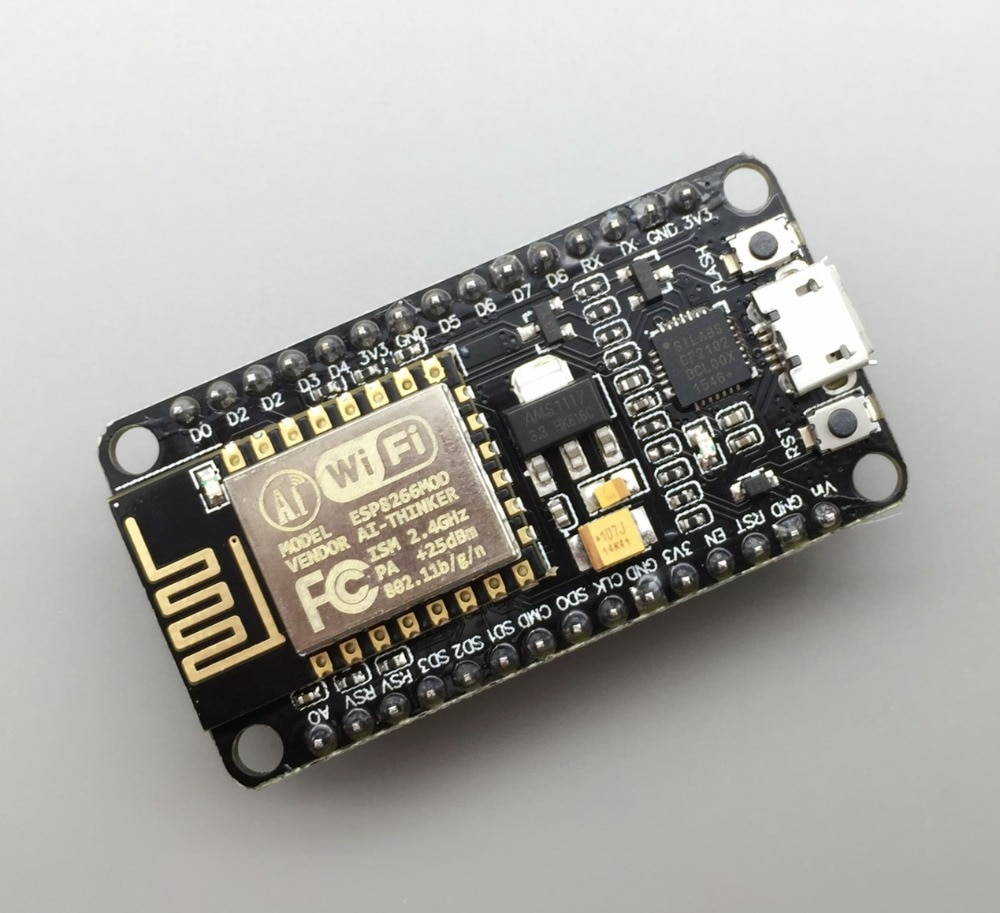

# Introduction

## Brief Overview

### What Are Microcontrollers?

In a sentence: microcontrollers are low-cost, low-level computers designed for use in dedicated applications. We'll present a more formal definition later.

Microcontrollers come in a variety of form factors (called "packages" in-industry) and are typically tiny (on the order of millimeters).

### How Can Microcontrollers Be Used?

Common use cases:
- Robotics
- Hardware automation and equipment control
- Networking and Internet of Things
- Audio/video coding
- Data acquisition systems
- Operating simple user interfaces
- Consumer devices
- Wearable technology
- Medical technology
- Prototyping

## Workshop Contents

- Microcontroller theory:
  - Electronics and digital logic
  - Computer elements and architecture
  - C language
  - Microcontroller design
- Microcontroller development and tools
- Hands-on project

## Prerequisites

- You have a computer with internet access that you are comfortable installing programs on.
- You have taken high basic physics (classical mechanics).
- You are not afraid of the terminal / command line.
- You want to learn about the underlying theory of microcontrollers!

[Home](index.md)
