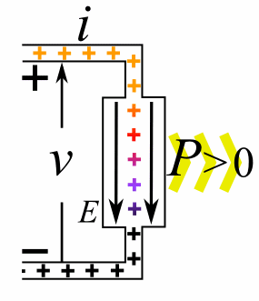
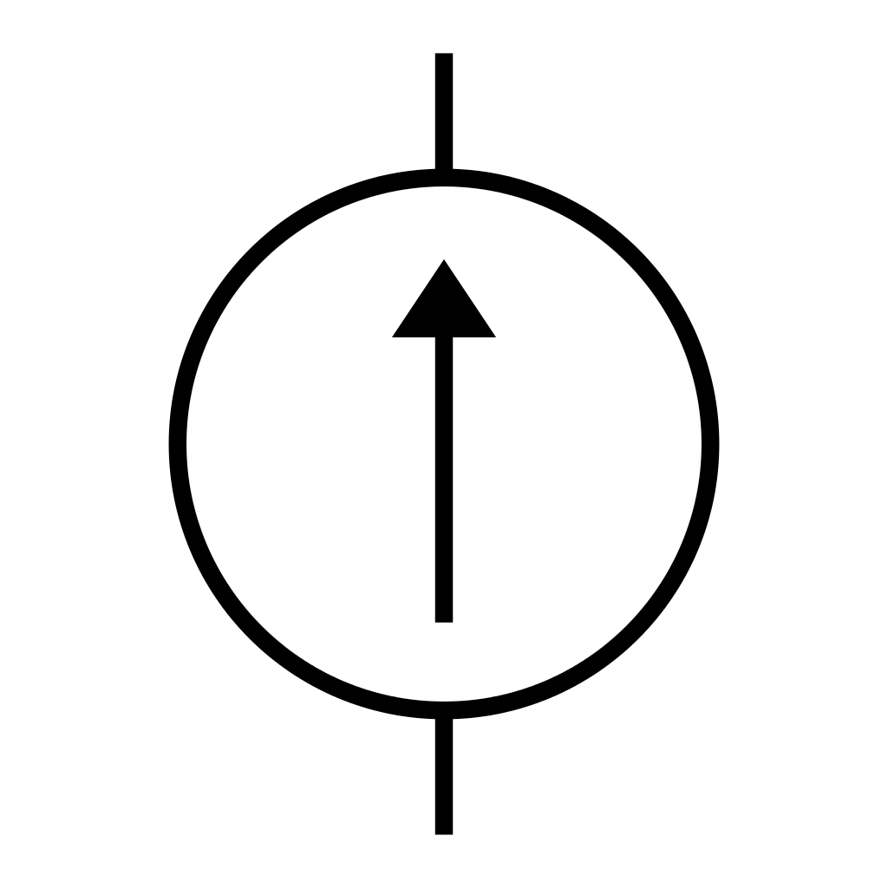

# Electronics

## Electronics Fundamentals

**Electricity** is the presence and movement of charge through conductive paths. We use several terms to quantify this movement of charge (denoted by dimensional value Q, with SI unit Coulomb [C]):

**Current** describes the rate of flow of charge past a reference point or through a reference surface.
- Dimensional value: Current \(I\) with SI unit: Ampere [A] = [C/s]
- Relation: \(I = Q / t\)

**Voltage** (aka Electric Potential or Electro-Motive Force) describes the amount of energy needed to move a unit charge between reference points in an electric field.
- Dimensional value: Voltage \(V\) with SI unit: Volt [V] = [J/C]
- Relation: \(V = E / Q\)

**Power** describes a rate of energy transfer. For electrical systems, this rate of energy transfer is in the form of charge crossing a potential over time.
- Dimensional value: Power \(P\) with SI unit: Watt [W] = [J/s]
- Relation: \(P = E/t = VQ/t = VI\)

These concepts together:

**Electronics** is the discipline using movement of charge to achieve engineering goals by use of circuits (any closed loop of conductors through which current can flow). Electrical circuits are documented in diagrams known as **Schematics**, which use common symbols for different types of circuit elements. Elements are connected via lines indicating conductive path, where a "close" indicates connection, and an "open" indicates lack of connection.

## Circuit Elements

Within the field of electronics, elements in circuits are divided into two categories: passive elements, and active elements. **Active elements** can add electrical energy to a system, control the flow of charge, or amplify power. **Passive elements** can only dissipate, absorb, or store electrical energy.

The passive elements most common in circuits (not an exhaustive list):

**Resistors** are passive elements that only dissipate energy.
- Dimensional value: Resistance \(R\) with SI unit Ohm [\(\Omega\)] = [V/A]
- Voltage-Current Relation: "Ohm's law": \(V = IR\)
- Schematic symbol: 

**Capacitors** are passive elements that store energy in an electric field (proportional to the voltage difference across the element).
- Dimensional value: Capacitance \(C\) with SI unit Farad [F] = [C/V]
- Voltage-Current Relation: \(V(t) = \frac{Q(t)}{C} = \frac{1}{C}\int_{t_0}^t I dt + V(t_0)\)
- Energy storage relation: \(E_C = \frac{1}{2}C V_C^2\)
- Schematic symbol: 

**Inductors** are passive elements that store energy in a magnetic field (proportional to the current through the element).
- Dimensional value: Inductance \(L\) with SI unit Henry [H] = [\(\Omega\)s]
- Voltage-Current Relation: \(\Delta V = -L \frac{dI}{dt}\)
- Energy storage relation: \(E_L = \frac{1}{2} L I_L^2\)
- Schematic symbol: 

The active elements most common in circuits (not an exhaustive list):

**Voltage sources** are active elements that supply power by means of controlled voltage (either static or dynamic). The current provided to the circuit will be determined by the load of the circuit, up to the power limit of the source (recall \(P = IV\)).
- Schematic symbol: 

**Current sources** are active elements that supply power by means of controlled current (either static or dynamic). The voltage provided to the circuit will be determined by the load of the circuit, up to the power limit of the source (recall \(P = IV\)).
- Schematic symbol: 

**Transistors** are active elements that amplify or switch power within a circuit. They will be discussed in detail in the next section.

Some common electrical circuit configurations relevant to design with microcontrollers include:
- Resistive Voltage Dividers
- Operational Amplifiers
- RC Low-Pass Filters
- Level Shifters
- Voltage Regulators

Note that most circuit design is done via schematic programs such as [Altium](https://www.altium.com/), [Autodesk EAGLE](https://www.autodesk.com/products/eagle/overview), or [KiCad](https://kicad-pcb.org/).

Circuit simulation is typically done with a [SPICE](https://en.wikipedia.org/wiki/SPICE) program such as [LTspice](https://www.analog.com/en/design-center/design-tools-and-calculators/ltspice-simulator.html), [ngspice](http://ngspice.sourceforge.net/xspice.html), or a simulator built-in with the chosen circuit design software suite.

_Demo_: Simple voltage divider with [PartSim](https://www.partsim.com/simulator).

## Transistors and Common Configurations

Transistors are active elements that amplify or switch power within a circuit. Their principle of operation is based exclusively on **semiconductors** - materials that are partially conductive (often having a controllable conductivity). The most common semiconductor is crystalline silicon. Semiconductors are often fabricated such that they have a built-in positive charge (**P-type**) or negative charge (**N-type**) by "doping" them to contain charge carrier atoms not native to the crystal lattice.

When a singular semiconductor crystal contains and adjacent P-type region and N-type region, this forms a **P-N junction**. At this interface between differently-doped regions, electrons can diffuse over the junction, which forms positive ions in the N region and negative ions in the P region. This configuration is particularly useful:

When **forward-biased** [a] (positive charge terminal aligned with P-type region, and vice-versa), charges are repelled towards the junction where they recombine with an incoming opposite polarity charge from the opposite region, forming current. When **reverse biased** [b] (negative charge terminal aligned with P-type region, and vice-versa), charges are attracted away from the junction, creating the "depletion region". Since there are no free electrons to jump the depletion region (and this would resist the natural direction of current), no current can flow.

The P-N junction [a] is one way to implement a **diode** (schematic symbol [b]), which is a passive element through which current can only flow in one direction. Non-ideal diodes do have a reverse bias voltage at which the depletion region can be overcome and current forced through the diode "backwards" [c].

An excellent video supplement to this discussion can be found [here](https://www.youtube.com/watch?v=TGUteH93xNo).

Now, we can approach transistors from a theoretical perspective. The simplest form of a transistor is a "bipolar junction transistor", which is a configuration of either P-N-P or N-P-N junctions. Transistors are three-terminal elements, with each terminal connected to one semiconductor region. BJT's have a "Collector", "Base", and "Emitter" region.

Since the Emitter region is always more heavily doped than the Collector, this favor current flow in a particular direction (direction of the arrow in the schematic symbol, by convention). In this configuration, the Base acts as a regulator for the current flowing from Collector to Emitter, or vice-versa (depending on the transistor polarity).

**PNP** BJTs [a] are "normally on" - there will always be current conduction / flow from Emitter to Collector unless positive current flow is supplied to the Base.

**NPN** BJTs [b] are "normally off" - there will be no current conduction / flow from Collector to Emitter unless positive current flow is supplied to the Base.

Here's an excellent [video](https://www.youtube.com/watch?v=fIvZen2tq_w) covering the theory above.

So far, we have discussed operating transistors either in the cutoff (no current \(I_C\)) or saturation (full current \(I_C\)) regions. It is also possible to operate in the forward active or reverse active regions, where collector current becomes proportional to base current. The active regions only become visible when the Collector-Emitter potential exceeds a certain (implementation-dependent) limit.

Transistors are particularly useful as electrical switches (operating in the cutoff and saturation regions exclusively), but with certain implementations they can also be used to build **Operational Amplifiers (op-amps)**. Op-amps are active circuit elements that produce an output signal proportional to their input. This proportion is also known as a **gain** value. There is a special case where the gain value is intentionally set to 1, where the op-amp operates as a "voltage follower" or "buffer". This is useful when trying to ensure that load on a circuit does not affect some input signal. More on op-amp theory [here](https://www.electronics-tutorials.ws/opamp/opamp_1.html). The remainder of this workshop will focus on using transistors primarily as switches in digital logic circuits.

One important observation: _operating in the cutoff or saturation regions requires very specific conditions on the Base and Collector-Emitter terminals_. Due to these conditions, it is possible to define a standard for operating conditions around which transistors for digital logic will be designed. Specifically, the standard describing maximum and minimum voltage, and switching voltage levels for logic transistors is called a **logic level**.

Typical logic levels in microcontroller applications are 5V nominal, 3.3V nominal, 1.8V nominal, or 1.2V nominal. The specific limits that determine the transition from "logic low" to "indeterminate" to "logic high" vary between different implementations. Be sure to check your supplier documentation for the standards used.

[Home](index.md)
