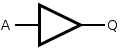

# Digital Logic

## Boolean Algebra

**Boolean Algebra** is the field of mathematics dealing with expressions that can be evaluated only to the values True (1) or False (0). Boolean algebra forms the core of any digital logic system.

### Basic Operators

Boolean algebra relies on common operations just like numeric algebra. Operators can work on one or more variables. Since the possible values for an output of an operator are discrete, we can form **truth tables** to describe the conditions that operators produce. The common operators are:

**NOT (aka negation or complement)**
| p | \(\neg\)p |
| - | - |
| T  | F  |
| F  | T  |

**AND (aka conjunction)**
| p | q | \(p \wedge q\) |
| - | - | - |
| T  | T  | T  |
| T  | F  | F  |
| F  | T  | F  |
| F  | F  | F  |

**OR (aka disjunction)**
| p | q | \(p \vee q\) |
| - | - | - |
| T  | T  | T  |
| T  | F  | T  |
| F  | T  | T  |
| F  | F  | F  |

**XOR (aka exclusive or)**
| p | q | \(p \oplus q\) |
| - | - | - |
| T  | T  | F  |
| T  | F  | T  |
| F  | T  | T  |
| F  | F  | F  |

**IMPLIES (aka implication or logical conditional)**
| p | q | \(p \rightarrow q\) |
| - | - | - |
| T  | T  | T  |
| T  | F  | F  |
| F  | T  | T  |
| F  | F  | T  |

**EQUIVALENCE (aka biconditional)**
| p | q | \(p \leftrightarrow q\) |
| - | - | - |
| T  | T  | T  |
| T  | F  | F  |
| F  | T  | F  |
| F  | F  | T  |

### Propositional Laws

Similar to numeric algebra, the operations in boolean algebra give rise to certain self-evident mathematical laws. Many of them are direct analogues to the laws in numerical algebra. In most cases, these laws are used to simplify propositions until they become **atomic propositions**, or propositions that cannot be expressed in terms of simpler propositions. The most common laws are as follows:

**De Morgan's laws**
  \(\neg(p \wedge q) \equiv \neg p \vee \neg q\)
  \(\neg(p \vee q) \equiv \neg p \wedge \neg q\)

**Identity laws**
  \(p \wedge T \equiv p\)
  \(p \vee F \equiv p\)

**Domination laws**:
  \(p \vee T \equiv T\)
  \(p \wedge F \equiv F\)

**Idempotent laws**:
  \(p \vee p \equiv p\)
  \(p \wedge p \equiv p\)

**Double negation law**:
  \(\neg (\neg p) \equiv p\)

**Commutative laws**:
  \(p \vee q \equiv q \vee p\)
  \(p \wedge q \equiv q \wedge p\)

**Associative laws**:
  \((p \vee q) \vee r \equiv p \vee (q \vee r)\)
  \((p \wedge q) \wedge r \equiv p \wedge (q \wedge r)\)

**Distributive laws**:
  \(p \vee (q \wedge r) \equiv (p \vee q) \wedge (p \vee r)\)
  \(p \wedge (q \vee r) \equiv (p \wedge q) \vee (p \wedge r)\)

**Absorption laws**:
  \(p \vee (p \wedge q) \equiv p\)
  \(p \wedge (p \vee q) \equiv p\)

**Negation laws**:
  \(p \vee \neg p \equiv T\)
  \(p \wedge \neg p \equiv F\)

## Logic Gates

We've observed the mathematical (symbolic) representation of boolean algebra operators and laws; now we can work towards understanding how they are represented with transistors.

The implementations of boolean operators in circuit are collectively called **logic gates**. Logic gates can be represented visually by schematic symbols within a logic circuit (a circuit in which the only tolerated values are voltages within the "True" band or "False" band, typically \(V_{MAX} \pm^0_{\texttt{tolerance}}\) to \(0 \pm^{\texttt{tolerance}}_0\)). Note that in these schematic symbols include a new convention: a "bubble" represents a negation at one of the terminals.

Recalling that implementations should work at some nominal logic level standard, determining an implementation for each gate requires picking a standard and then selecting underlying circuit elements. Only the NAND implementation in Transistor-Transistor Logic level (TTL) will be given, though the rest are easily searchable or available [via Wikipedia](https://en.wikipedia.org/wiki/Logic_gate#Symbols).

Common logic gates that may be supported by hardware:

**Buffer**

Buffers are the simplest logic gate; the output logic vale matches the input value. As mentioned prior, buffers are easily implemented with op-amps. Note that in an isolated logic circuit it is rarely necessary to include buffers, but when connecting logic circuits to outside electronics, buffers can be very handy for sinking or sourcing current at logic level, or matching a weak signal.

**NOT Gate (aka inverter)**

The NOT gate is functionally equivalent to the NOT boolean algebra operator. Its output is the complement of the input value.

**AND Gate**

The AND gate is functionally equivalent to the AND boolean algebra operator. Its output is true only if both input values are true.

**NAND Gate**

The NAND gate is effectively an AND gate with a trailing NOT gate. Notice that the symbol is visually identical to the AND gate with the "bubble" at the output, meaning the output is negated. NAND's truth table is the inverse of AND; its output is true only if both input values are not both true.

NAND has a special property in that combinations of only NAND gates can be used to reproduce the functions of any other logical operator. Logic gates with this property are referred to as **universal logic gates**.

NAND gates can be implemented simply with biasing resistors, one NPN transistor and one NPNN transistor (yes, that's right, [two emitters](https://en.wikipedia.org/wiki/Multiple-emitter_transistor)):

**OR Gate**

The OR gate is functionally equivalent to the OR boolean operator. Its output is true only if the inputs are not both false.

**NOR Gate**

The NOR gate is effectively an OR gate with a trailing NOT gate. Its output is true only if both inputs are false. Note that NOR is another universal logic gate. Recalling De Morgan's Laws:
\(\neg(p \wedge q) \equiv \neg p \vee \neg q\)
\(\neg(p \vee q) \equiv \neg p \wedge \neg q\)
the combinations of negation and OR or AND can be used to reach the other operator. Since NAND is a universal logic gate, NOR necessarily must be as well.

**XOR Gate**

The XOR gate is functionally equivalent to the XOR boolean operator. Its output is true only if the inputs have differing logic values.

**XNOR Gate**

The XNOR gate is effectively an XOR gate with a trailing NOT gate. It is also functionally equivalent to the biconditional boolean operator (logical equivalence). Its output is true only if both inputs share the same logic value. Note that XNOR is _not_ a universal logic gate.

For a full proof of universality of NAND and NOR, see [this resource](https://www.edupointbd.com/universality-of-nand-and-nor-gates/).

An online simulator for logic circuits can be found [here](https://circuitverse.org/simulator).

Devising and solving logic circuits can also be a fun puzzle when idle. If you have an Android device (or emulator), "Circuit Scramble" and "Make it True - Solve the Circuit" both scratch this itch.

## Implementation Options

Up to this point, we've discussed electronics primarily from a schematic point of view (with the exception of transistors). In this section, we'll discuss possible ways to realize circuits with commercial off-the-shelf (COTS) components.

**Stand-Alone Components**

The most straightforward way to build circuits is with stand-alone components (not a formal term). These are devices purchased commercially that serve as implementation of one electronic element (passive or active). Stand-alone components typically support either through-hole or surface-mount fabrication techniques.

**Integrated Circuits**

Integrated Circuits (ICs), also known as microchips, are collections of dedicated circuits implemented on a silicon wafer via photolithography. Where circuits composed of stand-alone components are made by soldering components onto a printed circuit board one component at a time, an integrated circuit's components are fabricated all at once. This makes mass manufacturing particularly easy, but also means that it is impossible to correct circuit errors after fabrication.

Integrated circuits expose electrical terminals as "pins", which lie either at the edge of the IC or underneath it. Where the terminals stand-alone components are defined by their electrical connections, integrated circuits are free to expose any net in the circuit on a pin.

Logic gates themselves can be exposed as integrated circuits, often in groups of four, though there are a wide variety of components expressed as ICs: microcontrollers, sensors, hardware drivers, discrete computer components, transistor bundles, voltage regulators, etc.

**Field-Programmable Gate Arrays (FPGAs)**

FPGAs are a configuration of integrated circuit in which the hardware can be configured after manufacture. To do so, the FPGA offers logic cells called **lookup tables (LUTs)**, which are effectively programmable truth tables for single operators. The LUTs can be flexibly wired to each other through a programmable **interconnect** system, and then programmed to interface with the external world via programmable **input/output (I/O) blocks**.

FPGAs expose outputs - typically far more than other types of ICs, so it is common to see FPGAs with pins exposed using the ball grid array (BGA) surface-mount technique, where all pins are exposed as round contact "balls" underneath the chip package.

Since FPGAs are so flexible, designing with them requires a pseudo-programming language called a **hardware description language (HDL)**, which converts human-readable logic and commands to the configuration that the FPGA expresses. The flexibility of FPGAs allows hardware designers to simulate the logic blocks of other (prototype) ICs and perform verification. Additionally, due to the large number of pins supported, FPGAs are popular in devices with high I/O requirements or applications requiring easily reconfigurable logic: audio/video encoding/decoding, software-defined radio, image processing, networking controllers, computer emulation, prototyping, etc.

While FPGA development is incredibly handy to hardware designers and some embedded systems applications, this workshop will focus primarily on microcontrollers, another type of integrated circuit.

[Home](index.md)
