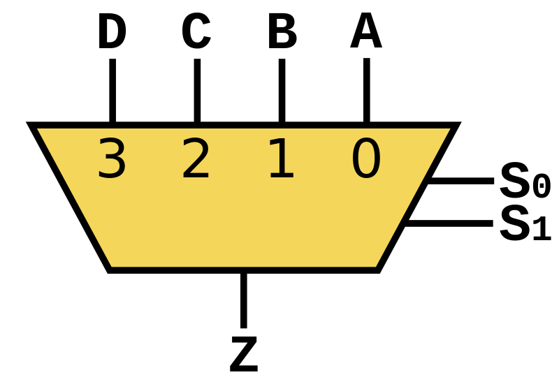

# Computer Elements and Architecture

Now that we have a theories to represent digital logic and binary numbers (which we can bring to reality by use of electrical circuits), if we want that system to accomplish practical, complex tasks, we need to organize it to do so. This section will describe the fundamental elements (composed of logic gates) used to develop the hierarchy of functionality we call a "computer".

## Computer Elements

Computer elements generally serve the purpose of storing, transmitting, or operating on either binary numbers or raw bits. For practical purposes, this workshop will only cover a handful of possible of these "building blocks" for computers.

### Latches, Registers, and Memory

One of the simplest ways to store data is called a **Flip-Flop, or Latch**. A latch is a computer element capable of storing the state of one bit.

The simplest latch is known as a **SR Latch**, where the circuit has two inputs (Set and Reset) and two outputs (Q and NOT-Q). Implemented via NOR gates, the SR latch has the following truth table:

| \(S\) | \(R\) | \(Q_{next}\) | Action |
| - | - | - | - |
| 0 | 0 | \(Q_{curr}\) | "hold" |
| 0 | 1 | 0 | "reset"  |
| 1 | 0 | 1 | "set" |
| 1 | 1 | x | indeterminate/illegal |

The main value that a simple SR latch provides is that when the Set and Reset inputs are both low (false), then the latch holds its current value. Then, when one of the inputs goes high, the output changes to accommodate the new condition.

In practice, a more complex latch known as a **Gated D Latch** is used. A Gated D Latch has some special properties. Being "gated" means that the latch has a special "enable" input: the latch state is only capable of changing when the enable line is high. Secondly, the D Latch takes advantage of the fact that output only changes for a SR Latch when S is the complement of R, so "D" and "NOT-D" represent these cases, with "D" for Data being the only input. Effectively, this means that the latch buffers Data when Enabled. The Gated D Latch has the following truth table:

| \(E\) | \(D\) | \(Q_{next}\) | Action |
|-|-|-|-|
| 0 | any | \(Q_{curr}\) | "hold" |
| 1 | 0 | 0 | "reset" |
| 1 | 1 | 1 | "set" |

The **D Flip-Flop** is a derivative of the Gated D Latch in which the enable condition (now called Clock) is instead defined by the rising or falling edge of the signal. In addition, the D Flip-Flop may expose the Set and Reset lines from the underlying SR Latch implementation (which ignore the Enable and Data lines). For most implementations, when Set and Reset are assigned high, the output is determined high; when Set and Reset are both low, this becomes the truth table:

| \(C\) | \(D\) | \(Q_{next}\) | Action |
|-|-|-|-|
| non-rising edge | any | \(Q_{curr}\) | "hold" |
| rising edge | 0 | 0 | "reset" |
| rising edge | 1 | 1 | "set" |

Now that we have a way of storing individual bits temporarily, we can move on to representing binary numbers via hardware. The simplest way to do this is by combining several D Flip-Flops as a collection known as a **hardware register**, in which all of the bits in the register can be set at once (though there are many other ways of implementing a register). For instance, a four-bit register can be implemented as follows:

Registers are often used to control other circuit elements by setting a reference state. Note that to assign values to a register, all bits must be available at once. When several data lines hold meaning as a collection, they are referred to as a group as a **Computer Bus**.

Another way to store binary information would be in the form of **Memory**, which describes a large set of bitfields that can only be accessed in "chunks" matching the bit width of the stored fields. To identify which bitfield to access, we use a **Memory Address**, which describes the index of the bitfield to target as offset from the first bitfield in memory. Generally, memory supports **Storing** (placing new values into memory) and **Loading** (retrieving a stored value), with some memory types also supporting operations to clear chunks of memory, or the entirety of memory.

Memory can be further divided into two categories: **Volatile Memory**, in which values in memory are kept only as long as the circuit has power, and **Non-Volatile Memory**, in which stored values are preserved even after loss of power.

### Multiplexers, Demultiplexers

A **Multiplexer (Mux)** is a computer element which selects and outputs one bit from a set of parallel input data lines. A **Demultiplexer (Demux)** does precisely the opposite: given one input, it selects one out of many possible output lines to connect to the input. A four-to-one mux would have the following truth table:

| \(S_1\) | \(S_0\) | \(Z\) |
|-|-|-|
| 0 | 0 | A |
| 0 | 1 | B |
| 1 | 0 | C |
| 1 | 1 | D |

### Arithmetic Operation: Adders

| \(A\) | \(B\) | \(C_{in}\) | \(S\) | \(C_{out}\) |
|-|-|-|-|-|
| 0 | 0 | 0 | 0 | 0 |
| 0 | 0 | 1 | 1 | 0 |
| 0 | 1 | 0 | 1 | 0 |
| 0 | 1 | 1 | 0 | 1 |
| 1 | 0 | 0 | 1 | 0 |
| 1 | 0 | 1 | 0 | 1 |
| 1 | 1 | 0 | 0 | 1 |
| 1 | 1 | 1 | 1 | 1 |

Addition as an operation takes two numbers and any existing carry value, and produces their sum and any resulting carry value. This paradigm also applies when adding binary numbers. An **Adder** is therefore an implementation of the addition operation in circuit.

The Full Adder takes in two bits \(A\) and \(B\), plus any existing carry bit \(C_{in}\) and produces the sum \(S\) and a resulting carry bit \(C_{out}\) for the operation. The truth table for a full adder is as shown.

A full adder only takes the sum of two bits, however. To take the sum of two \(n\)-bit binary numbers, we can simply perform the sum of each pair of bits in each sequence, and make sure we propagate the carry value as we would when adding by hand.

 

### Timers, Counters, and Clocking

`@todo clocking overview`
`@todo counter`
`@todo timer`

## Finite State Machines

`@todo concept and applications`

## Computer Architecture

`@todo formal definition of computer`
`@todo primary functional elements`
`@todo instructions, CPU cycle finite state machine`
`@todo practical computer architectures`

## Computer Programming Interface

`@todo instruction set architecture`
`@todo common operations coverage`
`@todo briefly cover assembly`
`@todo demo with webassembly (?)`

[Home](index.md)
