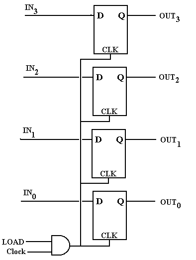

# Cal Poly Audio Engineering Society Workshop: Microcontroller Theory and Application

## Contents

<!-- TOC depthFrom:2 depthTo:2 -->

- [Contents](#contents)
- [Introduction](#introduction)
- [Electronics](#electronics)
- [Digital Logic](#digital-logic)
- [Binary Number Theory](#binary-number-theory)
- [Computer Elements and Architecture](#computer-elements-and-architecture)
- [High-Level Language Programming (with C)](#high-level-language-programming-with-c)
- [Microcontroller Hands-On](#microcontroller-hands-on)

<!-- /TOC -->

## Introduction

### Brief Overview

#### What Are Microcontrollers?

In a sentence: microcontrollers are low-cost, low-level computers designed for use in dedicated applications. We'll present a more formal definition later.

Microcontrollers come in a variety of form factors (called "packages" in-industry) and are typically tiny (on the order of millimeters).


#### How Can Microcontrollers Be Used?

Common use cases:
- Robotics
- Hardware automation and equipment control
- Networking and Internet of Things
- Audio/video coding
- Data acquisition systems
- Operating simple user interfaces
- Consumer devices
- Wearable technology
- Medical technology
- Prototyping


### Workshop Contents

- Microcontroller theory:
  - Electronics
  - Digital logic
  - Computer elements and architecture
  - C language
  - Microcontroller design
- Microcontroller development and tools
- Hands-on project

### Prerequisites

- You have a computer with internet access that you are comfortable installing programs on.
- You are not afraid of the terminal / command line.
- You want to learn about the underlying theory of microcontrollers!

[Index](#contents)


## Electronics

At its foundation, embedded systems are electrical systems that we've organized in such a way that they become useful. Microcontrollers happen to be one possible way of organizing an electrical system. To develop a solid theory for microcontrollers, we must first have a solid footing in electrical system theory.

### Electronics Fundamentals

**Electricity** is the presence and movement of charge through conductive paths. We use several terms to quantify this movement of charge (denoted by dimensional value Q, with SI unit Coulomb [C]):

**Current** describes the rate of flow of charge past a reference point or through a reference surface.
- Dimensional value: Current \(I\) with SI unit: Ampere [A] = [C/s]
- Relation: \(I = Q / t\)

**Voltage** (aka Electric Potential or Electro-Motive Force) describes the amount of energy needed to move a unit charge between reference points in an electric field.
- Dimensional value: Voltage \(V\) with SI unit: Volt [V] = [J/C]
- Relation: \(V = E / Q\)

**Power** describes a rate of energy transfer. For electrical systems, this rate of energy transfer is in the form of charge crossing a potential over time.
- Dimensional value: Power \(P\) with SI unit: Watt [W] = [J/s]
- Relation: \(P = E/t = VQ/t = VI\)

These concepts together:


**Electronics** is the discipline using movement of charge to achieve engineering goals by use of circuits (any closed loop of conductors through which current can flow). Electrical circuits are documented in diagrams known as **Schematics**, which use common symbols for different types of circuit elements. Elements are connected via lines indicating conductive path, where a "close" indicates connection, and an "open" indicates lack of connection.

### Basic Circuit Elements

Within the field of electronics, elements in circuits are divided into two categories: passive elements, and active elements. **Active elements** can add electrical energy to a system, control the flow of charge, or amplify power. **Passive elements** can only dissipate, absorb, or store electrical energy.

The passive elements most common in circuits (not an exhaustive list):

**Resistors** are passive elements that only dissipate energy.
- Dimensional value: Resistance \(R\) with SI unit Ohm [\(\Omega\)] = [V/A]
- Voltage-Current Relation: "Ohm's law": \(V = IR\)
- Schematic symbol: 

**Capacitors** are passive elements that store energy in an electric field (proportional to the voltage difference across the element).
- Dimensional value: Capacitance \(C\) with SI unit Farad [F] = [C/V]
- Voltage-Current Relation: \(V(t) = \frac{Q(t)}{C} = \frac{1}{C}\int_{t_0}^t I dt + V(t_0)\)
- Energy storage relation: \(E_C = \frac{1}{2}C V_C^2\)
- Schematic symbol: 

**Inductors** are passive elements that store energy in a magnetic field (proportional to the current through the element).
- Dimensional value: Inductance \(L\) with SI unit Henry [H] = [\(\Omega\)s]
- Voltage-Current Relation: \(\Delta V = -L \frac{dI}{dt}\)
- Energy storage relation: \(E_L = \frac{1}{2} L I_L^2\)
- Schematic symbol: 

The active elements most common in circuits (not an exhaustive list):

**Voltage sources** are active elements that supply power by means of controlled voltage (either static or dynamic). The current provided to the circuit will be determined by the load of the circuit, up to the power limit of the source (recall \(P = IV\)).
- Schematic symbol: 

**Current sources** are active elements that supply power by means of controlled current (either static or dynamic). The voltage provided to the circuit will be determined by the load of the circuit, up to the power limit of the source (recall \(P = IV\)).
- Schematic symbol: 

**Transistors** are active elements that amplify or switch power within a circuit. They will be discussed in detail in the next section.

Some common electrical circuit configurations relevant to design with microcontrollers include:
- Resistive Voltage Dividers
- Operational Amplifiers
- RC Low-Pass Filters
- Level Shifters
- Voltage Regulators

Note that most circuit design is done via schematic programs such as [Altium](https://www.altium.com/), [Autodesk EAGLE](https://www.autodesk.com/products/eagle/overview), or [KiCad](https://kicad-pcb.org/).

Circuit simulation is typically done with a [SPICE](https://en.wikipedia.org/wiki/SPICE) program such as [LTspice](https://www.analog.com/en/design-center/design-tools-and-calculators/ltspice-simulator.html), [ngspice](http://ngspice.sourceforge.net/xspice.html), or a simulator built-in with the chosen circuit design software suite.

_Demo_: Simple voltage divider with [PartSim](https://www.partsim.com/simulator) simulator.

### Transistors and Common Configurations

Transistors are active elements that amplify or switch power within a circuit. Their principle of operation is based exclusively on **semiconductors** - materials that are partially conductive (often having a controllable conductivity). The most common semiconductor is crystalline silicon. Semiconductors are often fabricated such that they have a built-in positive charge (**P-type**) or negative charge (**N-type**) by "doping" them to contain charge carrier atoms not native to the crystal lattice.

When a singular semiconductor crystal contains and adjacent P-type region and N-type region, this forms a **P-N junction**. At this interface between differently-doped regions, electrons can diffuse over the junction, which forms positive ions in the N region and negative ions in the P region. This configuration is particularly useful:


When **forward-biased** [a] (positive charge terminal aligned with P-type region, and vice-versa), charges are repelled towards the junction where they recombine with an incoming opposite polarity charge from the opposite region, forming current. When **reverse biased** [b] (negative charge terminal aligned with P-type region, and vice-versa), charges are attracted away from the junction, creating the "depletion region". Since there are no free electrons to jump the depletion region (and this would resist the natural direction of current), no current can flow.


The P-N junction [a] is one way to implement a **diode** (schematic symbol [b]), which is a passive element through which current can only flow in one direction. Non-ideal diodes do have a reverse bias voltage at which the depletion region can be overcome and current forced through the diode "backwards" [c].

An excellent video supplement to this discussion can be found [here](https://www.youtube.com/watch?v=TGUteH93xNo).

Now, we can approach transistors from a theoretical perspective. The simplest form of a transistor is a "bipolar junction transistor", which is a configuration of either P-N-P or N-P-N junctions. Transistors are three-terminal elements, with each terminal connected to one semiconductor region. BJT's have a "Collector", "Base", and "Emitter" region.


Since the Emitter region is always more heavily doped than the Collector, this favor current flow in a particular direction (direction of the arrow in the schematic symbol, by convention). In this configuration, the Base acts as a regulator for the current flowing from Collector to Emitter, or vice-versa (depending on the transistor polarity).


**PNP** BJTs [a] are "normally on" - there will always be current conduction / flow from Emitter to Collector unless positive current flow is supplied to the Base.

**NPN** BJTs [b] are "normally off" - there will be no current conduction / flow from Collector to Emitter unless positive current flow is supplied to the Base.

Here's an excellent [video](https://www.youtube.com/watch?v=fIvZen2tq_w) covering the theory above.


So far, we have discussed operating transistors either in the cutoff (no current \(I_C\)) or saturation (full current \(I_C\)) regions. It is also possible to operate in the forward active or reverse active regions, where collector current becomes proportional to base current. The active regions only become visible when the Collector-Emitter potential exceeds a certain (implementation-dependent) limit.

Transistors are particularly useful as electrical switches (operating in the cutoff and saturation regions exclusively), but with certain implementations they can also be used to build **Operational Amplifiers (op-amps)**. Op-amps are active circuit elements that produce an output signal proportional to their input. This proportion is also known as a **gain** value. There is a special case where the gain value is intentionally set to 1, where the op-amp operates as a "voltage follower" or "buffer". This is useful when trying to ensure that load on a circuit does not affect some input signal. More on op-amp theory [here](https://www.electronics-tutorials.ws/opamp/opamp_1.html). The remainder of this workshop will focus on using transistors primarily as switches in digital logic circuits.

One important observation: _operating in the cutoff or saturation regions requires very specific conditions on the Base and Collector-Emitter terminals_. Due to these conditions, it is possible to define a standard for operating conditions around which transistors for digital logic will be designed. Specifically, the standard describing maximum and minimum voltage, and switching voltage levels for logic transistors is called a **logic level**.

Typical logic levels in microcontroller applications are 5V nominal, 3.3V nominal, 1.8V nominal, or 1.2V nominal. The specific limits that determine the transition from "logic low" to "indeterminate" to "logic high" vary between different implementations. Be sure to check your supplier documentation for the standards used.

[Index](#contents)


## Digital Logic

Now that we have solid footing in understanding that electrical systems can produce circuits capable of stably representing two distinct states (digital systems), we need a theory allowing us to make statements in digital logic systems. This section will cover the mathematics supporting these digital logic systems.

### Boolean Algebra

**Boolean Algebra** is the field of mathematics dealing with expressions that can be evaluated only to the values True (1) or False (0). Boolean algebra forms the core of any digital logic system.

#### Basic Operators

Just like any other algebraic system, boolean algebra relies on a set of common "operators" to describe relationships between values. Operators can work on one or more variables. Since the possible values for an output of an operator are discrete, we can form **truth tables** to describe the conditions that operators produce. The common operators are:

**NOT (aka negation or complement)**
| \(p\) | \(\neg p\) |
| - | - |
| 1 | 0 |
| 0 | 1 |

**AND (aka conjunction)**
| \(p\) | \(q\) | \(p \wedge q\) |
| - | - | - |
| 0 | 0 | 0 |
| 0 | 1 | 0 |
| 1 | 0 | 0 |
| 1 | 1 | 1 |

**OR (aka disjunction)**
| \(p\) | \(q\) | \(p \vee q\) |
| - | - | - |
| 0 | 0 | 0 |
| 0 | 1 | 1 |
| 1 | 0 | 1 |
| 1 | 1 | 1 |

**XOR (aka exclusive or)**
| \(p\) | \(q\) | \(p \oplus q\) |
| - | - | - |
| 0 | 0 | 0 |
| 0 | 1 | 1 |
| 1 | 0 | 1 |
| 1 | 1 | 0 |

**IMPLIES (aka implication or logical conditional)**
| \(p\) | \(q\) | \(p \rightarrow q\) |
| - | - | - |
| 0 | 0 | 1 |
| 0 | 1 | 1 |
| 1 | 0 | 0 |
| 1 | 1 | 1 |

**EQUIVALENCE (aka biconditional)**
| \(p\) | \(q\) | \(p \leftrightarrow q\) |
| - | - | - |
| 0 | 0 | 1 |
| 0 | 1 | 0 |
| 1 | 0 | 0 |
| 1 | 1 | 1 |

#### Propositional Laws

Similar to numeric algebra, the operations in boolean algebra give rise to certain self-evident mathematical laws. Many of them are direct analogues to the laws in numerical algebra. In most cases, these laws are used to simplify propositions until they become **atomic propositions**, or propositions that cannot be expressed in terms of simpler propositions. The most common laws are as follows:

**De Morgan's laws**
  \(\neg(p \wedge q) \equiv \neg p \vee \neg q\)
  \(\neg(p \vee q) \equiv \neg p \wedge \neg q\)

**Identity laws**
  \(p \wedge 1 \equiv p\)
  \(p \vee 0 \equiv p\)

**Domination laws**:
  \(p \vee 1 \equiv 1\)
  \(p \wedge 0 \equiv 0\)

**Idempotent laws**:
  \(p \vee p \equiv p\)
  \(p \wedge p \equiv p\)

**Double negation law**:
  \(\neg (\neg p) \equiv p\)

**Commutative laws**:
  \(p \vee q \equiv q \vee p\)
  \(p \wedge q \equiv q \wedge p\)

**Associative laws**:
  \((p \vee q) \vee r \equiv p \vee (q \vee r)\)
  \((p \wedge q) \wedge r \equiv p \wedge (q \wedge r)\)

**Distributive laws**:
  \(p \vee (q \wedge r) \equiv (p \vee q) \wedge (p \vee r)\)
  \(p \wedge (q \vee r) \equiv (p \wedge q) \vee (p \wedge r)\)

**Absorption laws**:
  \(p \vee (p \wedge q) \equiv p\)
  \(p \wedge (p \vee q) \equiv p\)

**Negation laws**:
  \(p \vee \neg p \equiv 1\)
  \(p \wedge \neg p \equiv 0\)

### Logic Gates

We've observed the mathematical (symbolic) representation of boolean algebra operators and laws; now we can work towards understanding how they are represented with transistors.

The implementations of boolean operators in circuit are collectively called **logic gates**. Logic gates can be represented visually by schematic symbols within a logic circuit (a circuit in which the only tolerated values are voltages within the "True" band or "False" band, typically \(V_{MAX} \pm^0_{\texttt{tolerance}}\) to \(0 \pm^{\texttt{tolerance}}_0\)). Note that in these schematic symbols include a new convention: a "bubble" represents a negation at one of the terminals.

Recalling that implementations should work at some nominal logic level standard, determining an implementation for each gate requires picking a standard and then selecting underlying circuit elements. Only the NAND implementation in Transistor-Transistor Logic level (TTL) will be given, though the rest are easily searchable or available [via Wikipedia](https://en.wikipedia.org/wiki/Logic_gate#Symbols).

Common logic gates that may be supported by hardware:

**Buffer**

Buffers are the simplest logic gate; the output logic vale matches the input value. As mentioned prior, buffers are easily implemented with op-amps. Note that in an isolated logic circuit it is rarely necessary to include buffers, but when connecting logic circuits to outside electronics, buffers can be very handy for sinking or sourcing current at logic level, or matching a weak signal.

**NOT Gate (aka inverter)**

The NOT gate is functionally equivalent to the NOT boolean algebra operator. Its output is the complement of the input value.

**AND Gate**

The AND gate is functionally equivalent to the AND boolean algebra operator. Its output is true only if both input values are true.

**NAND Gate**

The NAND gate is effectively an AND gate with a trailing NOT gate. Notice that the symbol is visually identical to the AND gate with the "bubble" at the output, meaning the output is negated. NAND's truth table is the inverse of AND; its output is true only if both input values are not both true.

NAND has a special property in that combinations of only NAND gates can be used to reproduce the functions of any other logical operator. Logic gates with this property are referred to as **universal logic gates**.

NAND gates can be implemented simply with biasing resistors, one NPN transistor and one NPNN transistor (yes, that's right, [two emitters](https://en.wikipedia.org/wiki/Multiple-emitter_transistor)):


**OR Gate**

The OR gate is functionally equivalent to the OR boolean operator. Its output is true only if the inputs are not both false.

**NOR Gate**

The NOR gate is effectively an OR gate with a trailing NOT gate. Its output is true only if both inputs are false. Note that NOR is another universal logic gate. Recalling De Morgan's Laws:
\(\neg(p \wedge q) \equiv \neg p \vee \neg q\)
\(\neg(p \vee q) \equiv \neg p \wedge \neg q\)
the combinations of negation and OR or AND can be used to reach the other operator. Since NAND is a universal logic gate, NOR necessarily must be as well.

**XOR Gate**

The XOR gate is functionally equivalent to the XOR boolean operator. Its output is true only if the inputs have differing logic values.

**XNOR Gate**

The XNOR gate is effectively an XOR gate with a trailing NOT gate. It is also functionally equivalent to the biconditional boolean operator (logical equivalence). Its output is true only if both inputs share the same logic value. Note that XNOR is _not_ a universal logic gate.

For a full proof of universality of NAND and NOR, see [this resource](https://www.edupointbd.com/universality-of-nand-and-nor-gates/).

_Demo_: logic ladder via [CircuitVerse](https://circuitverse.org/simulator) simulator.

Devising and solving logic circuits can also be a fun puzzle when idle. If you have an Android device (or emulator), "Circuit Scramble" and "Make it True - Solve the Circuit" both scratch this itch.

### Implementation Options

Up to this point, we've discussed electronics primarily from a schematic point of view (with the exception of transistors). In this section, we'll discuss possible ways to realize circuits with commercial off-the-shelf (COTS) components.

**Stand-Alone Components**


The most straightforward way to build circuits is with stand-alone components (not a formal term). These are devices purchased commercially that serve as implementation of one electronic element (passive or active). Stand-alone components typically support either through-hole or surface-mount fabrication techniques.

**Integrated Circuits**


Integrated Circuits (ICs), also known as microchips, are collections of dedicated circuits implemented on a silicon wafer via photolithography. Where circuits composed of stand-alone components are made by soldering components onto a printed circuit board one component at a time, an integrated circuit's components are fabricated all at once. This makes mass manufacturing particularly easy, but also means that it is impossible to correct circuit errors after fabrication.

Integrated circuits expose electrical terminals as "pins", which lie either at the edge of the IC or underneath it. Where the terminals stand-alone components are defined by their electrical connections, integrated circuits are free to expose any net in the circuit on a pin.

Logic gates themselves can be exposed as integrated circuits, often in groups of four, though there are a wide variety of components expressed as ICs: microcontrollers, sensors, hardware drivers, discrete computer components, transistor bundles, voltage regulators, etc.

**Field-Programmable Gate Arrays (FPGAs)**

FPGAs are a configuration of integrated circuit in which the hardware can be configured after manufacture. To do so, the FPGA offers logic cells called **lookup tables (LUTs)**, which are effectively programmable truth tables for single operators. The LUTs can be flexibly wired to each other through a programmable **interconnect** system, and then programmed to interface with the external world via programmable **input/output (I/O) blocks**.

FPGAs expose outputs - typically far more than other types of ICs, so it is common to see FPGAs with pins exposed using the ball grid array (BGA) surface-mount technique, where all pins are exposed as round contact "balls" underneath the chip package.

Since FPGAs are so flexible, designing with them requires a pseudo-programming language called a **hardware description language (HDL)**, which converts human-readable logic and commands to the configuration that the FPGA expresses. The flexibility of FPGAs allows hardware designers to simulate the logic blocks of other (prototype) ICs and perform verification. Additionally, due to the large number of pins supported, FPGAs are popular in devices with high I/O requirements or applications requiring easily reconfigurable logic: audio/video encoding/decoding, software-defined radio, image processing, networking controllers, computer emulation, prototyping, etc.

While FPGA development is incredibly handy to hardware designers and some embedded systems applications, this workshop will focus primarily on microcontrollers, another type of integrated circuit.

[Index](#contents)


## Binary Number Theory

Up to this point, the theory and implementations have allowed us to create systems of simple logic circuits, but we need to be able to accomplish more complex tasks than logic alone can drive. First and foremost, we need a way to represent values that have meaning in engineering contexts: we need to represent numbers with logic systems.

First we must review how number systems work. In any number system, a value is represented by some sequence of "numeral" symbols in positions indexed as "digits". The "base" of a system is the count of different symbol corresponding to the first few natural numbers, including zero.

For example, in the decimal system (base 10), an integer \(a\) with three digits (denoted by subscript) holds value where:

\(a_2a_1a_0 = (a_2 * 10^2) + (a_1 * 10^1) + (a_0 * 10^0)\)

Generalizing, for any number system representing integer values, a number \(a\) with \(n\) digits in base \(b\) will have value such that:

\((a_na_{n-1}...a_1a_0)_b = \sum_{k=0}^{n} a_kb^k\)

where digit \(k\) holds value \(a_k * b^k\).

Naturally, this means there are other number systems we could use (base 8, base 16, etc), but more importantly, it implies that values are transferrable between different base systems. So, logic circuits, which are capable of representing only values true (1), or false (0), can represent a base 2 system: a binary number system. In binary, we consider digits as "bits". The "resolution" of a number can be described by the number of bits used to contain the value: the bit-width, or bit length.

The remainder of this section will describe how we represent increasingly complex kinds of numbers within a binary number system.

### Unsigned Integers

Unsigned integers are also know as the set of positive integers, including zero. They simply follow the case above, namely that unsigned integers expressed in binary have value:
\((a_na_{n-1}...a_1a_0)_2 = \sum_{k=0}^{n} a_k2^k\)

For a three-bit unsigned integers, counting upwards gives us:
| Binary | Decimal |
|-|-|
| 000 | 0 |
| 001 | 1 |
| 010 | 2 |
| 011 | 3 |
| 100 | 4 |
| 101 | 5 |
| 110 | 6 |
| 111 | 7 |

So, a \(n\)-bit unsigned integer can express \(2^n\) unique values with a minimum value of zero and a maximum value of \(2^n - 1\).

### Signed Integers

Signed integers can express a much more expansive set than unsigned integers, since they represent all integers (positive and negative).

To represent signed integers, we could use a system where we dedicate a bit to indicate sign, and the remaining bits hold the value (known as **sign-magnitude format**). In this format, the Most Significant Bit (MSb) holds the sign, and remaining bits hold the value with that sign. For instance, the four-bit signed integer 1001 in sign-magnitude format represents decimal value -1. In this system, the value zero has two distinct representations (signed zero is not meaningfully different). Where this system fails, however, is that we cannot do traditional arithmetic with the raw representation. For instance:
```
  0001 (decimal 1)
+ 1001 (decimal -1)
= 1010 (decimal -2) -> this is incorrect: should be decimal 0
```

To remedy this problem (incorrect resulting sign and incorrect carry), a system known as **Two's Complement** is used. In two's complement, to find the negative of a number in binary representation:
1) Take the complement of the unsigned representation of the number (flip all bits)
2) Add one

For instance (again for a four-bit signed integer):
```
  0001 (decimal 1)
  1110 (complement of decimal 1)
  1111 (two's complement representation of -1)
```

And we can check with a simple addition (assume 4 bits):
```
  0001 (decimal 1)
+ 1111 (decimal -1)
= 0000 (zero, carry 1, which is discarded) -> correct!
```

Then for a three-bit unsigned integer, counting downwards gives us:
| Binary | Decimal |
|-|-|
| 011 | 3 |
| 010 | 2 |
| 001 | 1 |
| 000 | 0 |
| 111 | -1 |
| 110 | -2 |
| 101 | -3 |
| 100 | -4 |

Notice that for two's complement, the inflection occurs between positive and negative numbers, counting zero as a positive number. Also note that there are no repeat values in this representation - zero has one representation only. Lastly, two's complement retains the ability to tell a number's sign using only the MSb. Using the two's complement system, signed integer numbers of bit-width \(n\) can also express \(2^n\) values, but the range now spans across zero from \(2^{n-1}-1\) to \(-2^{n-1}\).

### Floating Point Numbers

Floating point numbers are real numbers (positive or negative), which includes fractional numbers. Generally, floating point numbers have a format similar to:
\(\texttt{significand}*\texttt{base}^\texttt{exponent}\)
where the significand is the set of significant figures (digits) the number contains, and the base and exponent serve to move the radix - the point at which following digits represent fractional values. For instance, decimal value 1.2345 could have significand 12345, base 10, and exponent -4.

Then, the term "floating point" refers to the fact that the exponent is capable of "moving" the radix point to exist anywhere in the represented number (as opposed to "fixed point" representations, where the radix is in a fixed position). The tradeoff for floating point numbers - of having the radix move - is that the resolution of the number follows an uneven distribution depending on where along the number line the value is sampled (where fixed point representations do have an even distribution). Note that almost all representations of fractional values are estimates in practice - the trick is then determining the resolution requirements of the fractional values to be handled.

To ensure reasonable resolution at various points, the floating point standard [IEEE754](https://en.wikipedia.org/wiki/IEEE_754) was developed, which specifies a common binary representation for floating point numbers. It is the most common floating point standard in industry today (with widespread hardware and software support).

IEEE754 describes several precision levels. We'll discuss single precision numbers for brevity, which are colloquially known as "floats". Float format then follows in order as:
\(s\) - sign - one bit: zero for positive, one for negative
\(e\) - exponent - 8 bits: unsigned integer with built-in bias / offset
\(f\) - fraction - 23 bits: unsigned fractional value (MSb is \(2^{-1}\), etc...)

Note that IEEE754 floats are stored in sign-magnitude format, which again means we can't do direct arithmetic with them. IEEE754 floats carry value equal tot he following formula:
\(v = (1-2s)*(1+f)*2^{e-\texttt{bias}}\) (for decimal values \(s\), \(f\), and \(e\))
where "bias" = 127 for single precision floats.

IEEE754 floats do have some special cases:
- zero can be represented by an all-zero exponent with all-zero fraction (with both positive and negative sign equating to zero)
- positive or negative infinity can be represented by an all-ones exponent field with a zero fractional field
- "not a number" condition (catching non-real values like divide-by-zero or imaginary/complex numbers) can be represented by a zero sign bit, all-ones exponent, and nonzero fraction field

It is extremely uncommon to need to manually convert to and from floating point operation. That need may arise when dealing with arbitrary-precision applications, or resource-constrained applications requiring high speed, however.

### Bitwise Operations

Now that we have representations for the classes of numbers we will likely need to use in practice for most simple engineering problems, we can discuss operators for these representations.

We have already discussed adding binary numbers; all other arithmetic operators also apply to binary numbers. However, since the number representation is in a digital format, there are other operators we can also apply - namely, bitwise operations.

"Bitwise" describes the approach of manipulating individual bits within a binary number, treating it as a field (or sequence) of bits rather than a representation of numerical value. Typically, bitwise operations are done using unsigned integers only (on basis of semantics, to prevent confusion), though in theory any bit field can be manipulated in this manner.

In practice, the bitwise operators are identical to logical operators on a bit level, but when applied to bit fields, they perform the operation for all bits in both fields.

Examples of each bitwise operator:
```
NOT 0001
  = 1110

    0011
AND 0101
  = 0001

    1010
OR  1100
  = 1110

    1010
XOR 1100
  = 0110
```

There is one bitwise operator not accounted for by the logical operators (which arrives through the positional relationship of bits in a field): the "bit-shift", or "shift". A **Bit-Shift** is an operation which either adds or subtracts one to the positional index of all bits in a bit field. Shifts can therefore occur in a "leftward" direction, introducing a new bit as the LSb and discarding the MSb, or in a "rightward" direction, introducing a new bit as the MSb and discarding the LSb. An **Arithmetic Shift** is one which preserves the sign bit in rightward shifts (shifts in a new "1" bit for negative numbers, or zero for positive numbers), where a **Logical Shift** always introduces a "0" bit.

```
ALSHIFT 1001
      = 0010

ARSHIFT 1001
      = 1100

LLSHIFT 1001
      = 0010

LRSHIFT 1001
      = 0100
```

Note: a right-shift is equivalent to multiplying the value by two, and a left-shift is equivalent to diving the value by two.

[Index](#contents)


## Computer Elements and Architecture

Now that we have a theories to represent digital logic and binary numbers (which we can bring to reality by use of electrical circuits), if we want that system to accomplish practical, complex tasks, we need to organize it to do so. This section will describe the fundamental elements (composed of logic gates) used to develop the hierarchy of functionality we call a "computer".

### Finite State Machines

Central to most computer elements is the concept of a **Finite State Machine (FSM)** - a model of operation describing the fixed (finite) number of operating states a system can be in at any time. FSMs are useful in documenting and understanding how a system can flow between different states. FSMs are typically documented via a **State Transition Table**, which is very similar to a truth table, but instead describes _change_. For the visually-oriented, **State Diagrams** can also be used to describe FSMs. In both cases, it is critical to document the conditions that cause state transitions, as well as the effects of the transition.

For instance, the state transition table for a mechanical turnstile could look like the following:

| Current State | Condition | Next State | Effects |
|-|-|-|-|
| Locked | coin inserted | Unlocked | Unlocks the turnstile, allows pushing through |
| Locked | customer pushes | Locked | No effect |
| Unlocked | coin inserted | Unlocked | Coin returned; already unlocked |
| Unlocked | customer pushes | Locked | Locks after one full rotation |

The equivalent transition diagram could look like the following:


FSMs are also particularly useful when developing new systems as a means of exploring behavioral requirements and checking validity of behavior.

### Computer Elements

Computer elements generally serve the purpose of storing, transmitting, or operating on either binary numbers or raw bits. For practical purposes, this workshop will only cover a handful of possible of these "building blocks" for computers.

#### Latches, Registers, and Memory

One of the simplest ways to store data is called a **Flip-Flop, or Latch**. A latch is a computer element capable of storing the state of one bit.

The simplest latch is known as a **SR Latch**, where the circuit has two inputs (Set and Reset) and two outputs (Q and NOT-Q). Implemented via NOR gates, the SR latch has the following state transition table:

<div width="40%" style="float:left; margin-right:10px;">

| \(S\) | \(R\) | \(Q_{next}\) | Action |
| - | - | - | - |
| 0 | 0 | \(Q_{curr}\) | "hold" |
| 0 | 1 | 0 | "reset"  |
| 1 | 0 | 1 | "set" |
| 1 | 1 | x | indeterminate/illegal |
</div>


The main value that a simple SR latch provides is that when the Set and Reset inputs are both low (false), then the latch holds its current value. Then, when one of the inputs goes high, the output changes to accommodate the new condition.

In practice, a more complex latch known as a **Gated D Latch** is used. A Gated D Latch has some special properties. Being "gated" means that the latch has a special "enable" input: the latch state is only capable of changing when the enable line is high. Secondly, the D Latch takes advantage of the fact that output only changes for a SR Latch when S is the complement of R, so "D" and "NOT-D" represent these cases, with "D" for Data being the only input. Effectively, this means that the latch buffers Data when Enabled. The Gated D Latch has the following state transition table:

<div width="40%" style="float:left; margin-right:10px;">

| \(E\) | \(D\) | \(Q_{next}\) | Action |
|-|-|-|-|
| 0 | any | \(Q_{curr}\) | "hold" |
| 1 | 0 | 0 | "reset" |
| 1 | 1 | 1 | "set" |
</div>


The **D Flip-Flop** is a derivative of the Gated D Latch in which the enable condition (now called Clock) is instead defined by the rising or falling edge of the signal. In addition, the D Flip-Flop may expose the Set and Reset lines from the underlying SR Latch implementation (which ignore the Enable and Data lines). For most implementations, when Set and Reset are assigned high, the output is determined high; when Set and Reset are both low, this becomes the state transition table:

<div width="40%" style="float:left; margin-right:10px;">

| \(C\) | \(D\) | \(Q_{next}\) | Action |
|-|-|-|-|
| non-rising edge | any | \(Q_{curr}\) | "hold" |
| rising edge | 0 | 0 | "reset" |
| rising edge | 1 | 1 | "set" |
</div>


Now that we have a way of storing individual bits temporarily, we can move on to representing binary numbers via hardware. The simplest way to do this is by combining several D Flip-Flops as a collection known as a **hardware register**, in which all of the bits in the register can be set at once (though there are many other ways of implementing a register). For instance, a four-bit register can be implemented as follows:



Registers are often used to control other circuit elements by setting a reference state. Note that to assign values to a register, all bits must be available at once. When several data lines hold meaning as a collection, they are referred to as a group as a **Computer Bus**.

Another way to store binary information would be in the form of **Memory**, which describes a large set of bitfields that can only be accessed in "chunks" matching the bit width of the stored fields. To identify which bitfield to access, we use a **Memory Address**, which describes the index of the bitfield to target as offset from the first bitfield in memory. Generally, memory supports **Storing** (placing new values into memory) and **Loading** (retrieving a stored value), with some memory types also supporting operations to clear chunks of memory, or the entirety of memory.

Memory can be further divided into two categories: **Volatile Memory**, in which values in memory are kept only as long as the circuit has power, and **Non-Volatile Memory**, in which stored values are preserved even after loss of power.

#### Multiplexers, Demultiplexers

A **Multiplexer (Mux)** is a computer element which selects and outputs one bit from a set of parallel input data lines. A **Demultiplexer (Demux)** does precisely the opposite: given one input, it selects one out of many possible output lines to connect to the input. A four-to-one mux would have the following truth table:

<div width="40%" style="float:left; margin-right:10px;">

| \(S_1\) | \(S_0\) | \(Z\) |
|-|-|-|
| 0 | 0 | A |
| 0 | 1 | B |
| 1 | 0 | C |
| 1 | 1 | D |
</div>


#### Arithmetic Operation: Adders

<div width="40%" style="float:left; margin-right:10px;">

| \(A\) | \(B\) | \(C_{in}\) | \(S\) | \(C_{out}\) |
|-|-|-|-|-|
| 0 | 0 | 0 | 0 | 0 |
| 0 | 0 | 1 | 1 | 0 |
| 0 | 1 | 0 | 1 | 0 |
| 0 | 1 | 1 | 0 | 1 |
| 1 | 0 | 0 | 1 | 0 |
| 1 | 0 | 1 | 0 | 1 |
| 1 | 1 | 0 | 0 | 1 |
| 1 | 1 | 1 | 1 | 1 |
</div>

Addition as an operation takes two numbers and any existing carry value, and produces their sum and any resulting carry value. This paradigm also applies when adding binary numbers. An **Adder** is therefore an implementation of the addition operation in circuit.


The Full Adder takes in two bits \(A\) and \(B\), plus any existing carry bit \(C_{in}\) and produces the sum \(S\) and a resulting carry bit \(C_{out}\) for the operation. The truth table for a full adder is as shown.

A full adder takes the sum of just two bits, however. To take the sum of two \(n\)-bit binary numbers, we can simply perform the sum of each pair of bits in each sequence, and make sure we propagate the carry value as we would when adding by hand.

<br>


There are many other implementations of both arithmetic and logical operators in practice. More operators will be discussed later.

#### Timers, Counters, and Clocking

One major problem in the construction of digital logic circuits is synchronization - making sure that all relevant changes in line levels are accounted for, rather than skipped or double-counted. One of the most common ways to deal with synchronization is to include a **clock signal**, which is used to step multiple computer elements simultaneously. A clock signal is one that oscillates between high and low at a deterministic rate. It is effectively a timekeeping device: anything connected to the clock signals steps in time with one edge of the clock as it toggles.

A very rudimentary clock can be constructed from an op-amp, a resistor, and capacitor in the form of an [RC Oscillator](https://www.ti.com/lit/an/snoa998/snoa998.pdf). The RC Oscillator takes advantage of the time constant involved with charging a capacitor via a current-limited resistor element. In practice, however, RC Oscillators are particularly inaccurate because the clock frequency relies on part tolerances.

A different clock implementation that is very common in embedded systems is a [Piezoelectric Crystal Oscillator (Crystal Oscillator)](https://www.youtube.com/watch?v=fPKdDCiJDok). Typically, crystal-based oscillators have a much higher accuracy and less drift over time.

Clock signals are helpful beyond just synchronizing state machines as well. We can use a **Counter** element to quantify the amount of time that has passed. A counter is a collection of flip flops whose state represents the number of clock pulses seen at input. Counters can either be synchronous (where one clock signal causes all flip-flops to update state simultaneously), or asynchronous (where the clock signal drives only the first flip-flop, which serially drives the next, etc). Synchronous counters are generally faster because they perform the state update in parallel.

For example, a three-bit up-counter can be implemented with three positive edge triggered D flip-flops:


Finally, now that we can determine the amount of time that has elapsed since the last counter reset, it is possible to use this information to trigger events. A module that can send signals based on the status of a counter is known as a **Timer**. A simple implementation of a timer could maintain a target register and counter, and after each clock step, perform a bitwise equality check between the target register and counter value. The timer could then optionally trigger different events for counter overflow/return to zero, or a match on the comparison with the target register and counter value.

### Computer Architecture

With theoretical understanding of how logic circuits behave and can be combined into functional structures, we can now finally define what a computer is. A **Computer** is any machine that stores, retrieves, and processes data _automatically_; that is, it can be instructed to perform sequences of arithmetic or logical operations, and it will carry out those operations with no further input.


`@todo formal definition of computer`
`@todo primary functional elements`
`@todo instructions, CPU cycle finite state machine`
`@todo practical computer architectures`

### Computer Programming Interface

`@todo instruction set architecture`
`@todo common operations coverage`
`@todo briefly cover assembly`
`@todo demo with webassembly (?)`

[Index](#contents)


## High-Level Language Programming (with C)

`@todo organize and write this`

[Index](#contents)


## Microcontroller Hands-On

`@todo organize and write this`

[Index](#contents)
