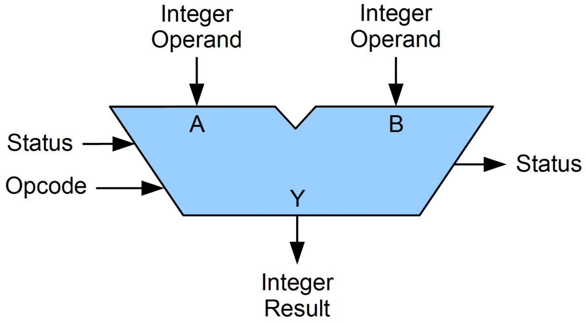

# Cal Poly Audio Engineering Society Workshop: Microcontroller Theory and Application

## Contents

<!-- TOC depthFrom:2 depthTo:2 -->

- [Contents](#contents)
- [Introduction](#introduction)
- [Electronics](#electronics)
- [Digital Logic](#digital-logic)
- [Binary Number Theory](#binary-number-theory)
- [Computer Elements](#computer-elements)
- [Computer Architecture](#computer-architecture)
- [High-Level Language Programming (with C)](#high-level-language-programming-with-c)
- [Microcontroller Theory](#microcontroller-theory)
- [Microcontroller Hands-On Application: MIDI Controller Project](#microcontroller-hands-on-application-midi-controller-project)
- [Parting Words and Resources](#parting-words-and-resources)

<!-- /TOC -->

## Introduction

### Brief Overview

#### What Are Microcontrollers?

In a sentence: microcontrollers are low-cost, low-level computers designed for use in dedicated applications. We'll present a more formal definition later.

Microcontrollers come in a variety of form factors (called "packages" in-industry) and are typically tiny (on the order of millimeters).


#### How Can Microcontrollers Be Used?

Common use cases:
- Robotics
- Hardware automation and equipment control
- Networking and Internet of Things
- Audio/video coding
- Data acquisition systems
- Operating simple user interfaces
- Consumer devices
- Wearable technology
- Medical technology
- Prototyping


### Workshop Contents

- Microcontroller theory:
  - Electronics
  - Digital logic
  - Computer elements and architecture
  - C language
  - Microcontroller design
- Microcontroller development and tools
- Hands-on project

### Prerequisites

- You have a computer with internet access that you are comfortable installing programs on.
- You are not afraid of the terminal / command line.
- You want to learn about the underlying theory of microcontrollers!

[Index](#contents)


## Electronics

At its foundation, embedded systems are electrical systems that we've organized in such a way that they become useful. Microcontrollers happen to be one possible way of organizing an electrical system. To develop a solid theory for microcontrollers, we must first have a solid footing in electrical system theory.

### Electronics Fundamentals

**Electricity** is the presence and movement of charge through conductive paths. We use several terms to quantify this movement of charge (denoted by dimensional value Q, with SI unit Coulomb [C]):

**Current** describes the rate of flow of charge past a reference point or through a reference surface.
- Dimensional value: Current \(I\) with SI unit: Ampere [A] = [C/s]
- Relation: \(I = Q / t\)

**Voltage** (aka Electric Potential or Electro-Motive Force) describes the amount of energy needed to move a unit charge between reference points in an electric field.
- Dimensional value: Voltage \(V\) with SI unit: Volt [V] = [J/C]
- Relation: \(V = E / Q\)

**Power** describes a rate of energy transfer. For electrical systems, this rate of energy transfer is in the form of charge crossing a potential over time.
- Dimensional value: Power \(P\) with SI unit: Watt [W] = [J/s]
- Relation: \(P = E/t = VQ/t = VI\)

These concepts together:


**Electronics** is the discipline using movement of charge to achieve engineering goals by use of circuits (any closed loop of conductors through which current can flow). Electrical circuits are documented in diagrams known as **Schematics**, which use common symbols for different types of circuit elements. Elements are connected via lines indicating conductive path, where a "close" indicates connection, and an "open" indicates lack of connection.

### Basic Circuit Elements

Within the field of electronics, elements in circuits are divided into two categories: passive elements, and active elements. **Active elements** can add electrical energy to a system, control the flow of charge, or amplify power. **Passive elements** can only dissipate, absorb, or store electrical energy.

The passive elements most common in circuits (not an exhaustive list):

**Resistors** are passive elements that only dissipate energy.
- Dimensional value: Resistance \(R\) with SI unit Ohm [\(\Omega\)] = [V/A]
- Voltage-Current Relation: "Ohm's law": \(V = IR\)
- Schematic symbol: 

**Capacitors** are passive elements that store energy in an electric field (proportional to the voltage difference across the element).
- Dimensional value: Capacitance \(C\) with SI unit Farad [F] = [C/V]
- Voltage-Current Relation: \(V(t) = \frac{Q(t)}{C} = \frac{1}{C}\int_{t_0}^t I dt + V(t_0)\)
- Energy storage relation: \(E_C = \frac{1}{2}C V_C^2\)
- Schematic symbol: 

**Inductors** are passive elements that store energy in a magnetic field (proportional to the current through the element).
- Dimensional value: Inductance \(L\) with SI unit Henry [H] = [\(\Omega\)s]
- Voltage-Current Relation: \(\Delta V = -L \frac{dI}{dt}\)
- Energy storage relation: \(E_L = \frac{1}{2} L I_L^2\)
- Schematic symbol: 

The active elements most common in circuits (not an exhaustive list):

**Voltage sources** are active elements that supply power by means of controlled voltage (either static or dynamic). The current provided to the circuit will be determined by the load of the circuit, up to the power limit of the source (recall \(P = IV\)).
- Schematic symbol: 

**Current sources** are active elements that supply power by means of controlled current (either static or dynamic). The voltage provided to the circuit will be determined by the load of the circuit, up to the power limit of the source (recall \(P = IV\)).
- Schematic symbol: 

**Transistors** are active elements that amplify or switch power within a circuit. They will be discussed in detail in the next section.

Some common electrical circuit configurations relevant to design with microcontrollers include:
- Resistive Voltage Dividers
- Operational Amplifiers
- RC Low-Pass Filters
- Level Shifters
- Voltage Regulators

Note that most circuit design is done via schematic programs such as [Altium](https://www.altium.com/), [Autodesk EAGLE](https://www.autodesk.com/products/eagle/overview), or [KiCad](https://kicad-pcb.org/).

Circuit simulation is typically done with a [SPICE](https://en.wikipedia.org/wiki/SPICE) program such as [LTspice](https://www.analog.com/en/design-center/design-tools-and-calculators/ltspice-simulator.html), [ngspice](http://ngspice.sourceforge.net/xspice.html), or a simulator built-in with the chosen circuit design software suite.

_Demo_: Simple voltage divider with [PartSim](https://www.partsim.com/simulator) simulator.

### Transistors and Common Configurations

Transistors are active elements that amplify or switch power within a circuit. Their principle of operation is based exclusively on **semiconductors** - materials that are partially conductive (often having a controllable conductivity). The most common semiconductor is crystalline silicon. Semiconductors are often fabricated such that they have a built-in positive charge (**P-type**) or negative charge (**N-type**) by "doping" them to contain charge carrier atoms not native to the crystal lattice.

When a singular semiconductor crystal contains and adjacent P-type region and N-type region, this forms a **P-N junction**. At this interface between differently-doped regions, electrons can diffuse over the junction, which forms positive ions in the N region and negative ions in the P region. This configuration is particularly useful:


When **forward-biased** [a] (positive charge terminal aligned with P-type region, and vice-versa), charges are repelled towards the junction where they recombine with an incoming opposite polarity charge from the opposite region, forming current. When **reverse biased** [b] (negative charge terminal aligned with P-type region, and vice-versa), charges are attracted away from the junction, creating the "depletion region". Since there are no free electrons to jump the depletion region (and this would resist the natural direction of current), no current can flow.


The P-N junction [a] is one way to implement a **diode** (schematic symbol [b]), which is a passive element through which current can only flow in one direction. Non-ideal diodes do have a reverse bias voltage at which the depletion region can be overcome and current forced through the diode "backwards" [c].

An excellent video supplement to this discussion can be found [here](https://www.youtube.com/watch?v=TGUteH93xNo).

Now, we can approach transistors from a theoretical perspective. The simplest form of a transistor is a "bipolar junction transistor", which is a configuration of either P-N-P or N-P-N junctions. Transistors are three-terminal elements, with each terminal connected to one semiconductor region. BJT's have a "Collector", "Base", and "Emitter" region.


Since the Emitter region is always more heavily doped than the Collector, this favor current flow in a particular direction (direction of the arrow in the schematic symbol, by convention). In this configuration, the Base acts as a regulator for the current flowing from Collector to Emitter, or vice-versa (depending on the transistor polarity).


**PNP** BJTs [a] are "normally on" - there will always be current conduction / flow from Emitter to Collector unless positive current flow is supplied to the Base.

**NPN** BJTs [b] are "normally off" - there will be no current conduction / flow from Collector to Emitter unless positive current flow is supplied to the Base.

Here's an excellent [video](https://www.youtube.com/watch?v=fIvZen2tq_w) covering the theory above.


So far, we have discussed operating transistors either in the cutoff (no current \(I_C\)) or saturation (full current \(I_C\)) regions. It is also possible to operate in the forward active or reverse active regions, where collector current becomes proportional to base current. The active regions only become visible when the Collector-Emitter potential exceeds a certain (implementation-dependent) limit.

Transistors are particularly useful as electrical switches (operating in the cutoff and saturation regions exclusively), but with certain implementations they can also be used to build **Operational Amplifiers (op-amps)**. Op-amps are active circuit elements that produce an output signal proportional to their input. This proportion is also known as a **gain** value. There is a special case where the gain value is intentionally set to 1, where the op-amp operates as a "voltage follower" or "buffer". This is useful when trying to ensure that load on a circuit does not affect some input signal. More on op-amp theory [here](https://www.electronics-tutorials.ws/opamp/opamp_1.html). The remainder of this workshop will focus on using transistors primarily as switches in digital logic circuits.

One important observation: _operating in the cutoff or saturation regions requires very specific conditions on the Base and Collector-Emitter terminals_. Due to these conditions, it is possible to define a standard for operating conditions around which transistors for digital logic will be designed. Specifically, the standard describing maximum and minimum voltage, and switching voltage levels for logic transistors is called a **logic level**.

Typical logic levels in microcontroller applications are 5V nominal, 3.3V nominal, 1.8V nominal, or 1.2V nominal. The specific limits that determine the transition from "logic low" to "indeterminate" to "logic high" vary between different implementations. Be sure to check your supplier documentation for the standards used.

[Index](#contents)


## Digital Logic

Now that we have solid footing in understanding that electrical systems can produce circuits capable of stably representing two distinct states (digital systems), we need a theory allowing us to make statements in digital logic systems. This section will cover the mathematics supporting these digital logic systems.

### Boolean Algebra

**Boolean Algebra** is the field of mathematics dealing with expressions that can be evaluated only to the values True (1) or False (0). Boolean algebra forms the core of any digital logic system.

#### Basic Operators

Just like any other algebraic system, boolean algebra relies on a set of common "operators" to describe relationships between values. Operators can work on one or more variables. Since the possible values for an output of an operator are discrete, we can form **truth tables** to describe the conditions that operators produce. The common operators are:

**NOT (aka negation or complement)**
| \(p\) | \(\neg p\) |
| - | - |
| 1 | 0 |
| 0 | 1 |

**AND (aka conjunction)**
| \(p\) | \(q\) | \(p \wedge q\) |
| - | - | - |
| 0 | 0 | 0 |
| 0 | 1 | 0 |
| 1 | 0 | 0 |
| 1 | 1 | 1 |

**OR (aka disjunction)**
| \(p\) | \(q\) | \(p \vee q\) |
| - | - | - |
| 0 | 0 | 0 |
| 0 | 1 | 1 |
| 1 | 0 | 1 |
| 1 | 1 | 1 |

**XOR (aka exclusive or)**
| \(p\) | \(q\) | \(p \oplus q\) |
| - | - | - |
| 0 | 0 | 0 |
| 0 | 1 | 1 |
| 1 | 0 | 1 |
| 1 | 1 | 0 |

**IMPLIES (aka implication or logical conditional)**
| \(p\) | \(q\) | \(p \rightarrow q\) |
| - | - | - |
| 0 | 0 | 1 |
| 0 | 1 | 1 |
| 1 | 0 | 0 |
| 1 | 1 | 1 |

**EQUIVALENCE (aka biconditional)**
| \(p\) | \(q\) | \(p \leftrightarrow q\) |
| - | - | - |
| 0 | 0 | 1 |
| 0 | 1 | 0 |
| 1 | 0 | 0 |
| 1 | 1 | 1 |

#### Propositional Laws

Similar to numeric algebra, the operations in boolean algebra give rise to certain self-evident mathematical laws. Many of them are direct analogues to the laws in numerical algebra. In most cases, these laws are used to simplify propositions until they become **atomic propositions**, or propositions that cannot be expressed in terms of simpler propositions. The most common laws are as follows:

**De Morgan's laws**
  \(\neg(p \wedge q) \equiv \neg p \vee \neg q\)
  \(\neg(p \vee q) \equiv \neg p \wedge \neg q\)

**Identity laws**
  \(p \wedge 1 \equiv p\)
  \(p \vee 0 \equiv p\)

**Domination laws**:
  \(p \vee 1 \equiv 1\)
  \(p \wedge 0 \equiv 0\)

**Idempotent laws**:
  \(p \vee p \equiv p\)
  \(p \wedge p \equiv p\)

**Double negation law**:
  \(\neg (\neg p) \equiv p\)

**Commutative laws**:
  \(p \vee q \equiv q \vee p\)
  \(p \wedge q \equiv q \wedge p\)

**Associative laws**:
  \((p \vee q) \vee r \equiv p \vee (q \vee r)\)
  \((p \wedge q) \wedge r \equiv p \wedge (q \wedge r)\)

**Distributive laws**:
  \(p \vee (q \wedge r) \equiv (p \vee q) \wedge (p \vee r)\)
  \(p \wedge (q \vee r) \equiv (p \wedge q) \vee (p \wedge r)\)

**Absorption laws**:
  \(p \vee (p \wedge q) \equiv p\)
  \(p \wedge (p \vee q) \equiv p\)

**Negation laws**:
  \(p \vee \neg p \equiv 1\)
  \(p \wedge \neg p \equiv 0\)

### Logic Gates

We've observed the mathematical (symbolic) representation of boolean algebra operators and laws; now we can work towards understanding how they are represented with transistors.

The implementations of boolean operators in circuit are collectively called **logic gates**. Logic gates can be represented visually by schematic symbols within a logic circuit (a circuit in which the only tolerated values are voltages within the "True" band or "False" band, typically \(V_{MAX} \pm^0_{\texttt{tolerance}}\) to \(0 \pm^{\texttt{tolerance}}_0\)). Note that in these schematic symbols include a new convention: a "bubble" represents a negation at one of the terminals.

Recalling that implementations should work at some nominal logic level standard, determining an implementation for each gate requires picking a standard and then selecting underlying circuit elements. Only the NAND implementation in Transistor-Transistor Logic level (TTL) will be given, though the rest are easily searchable or available [via Wikipedia](https://en.wikipedia.org/wiki/Logic_gate#Symbols).

Common logic gates that may be supported by hardware:

**Buffer**

Buffers are the simplest logic gate; the output logic vale matches the input value. As mentioned prior, buffers are easily implemented with op-amps. Note that in an isolated logic circuit it is rarely necessary to include buffers, but when connecting logic circuits to outside electronics, buffers can be very handy for sinking or sourcing current at logic level, or matching a weak signal.

**NOT Gate (aka inverter)**

The NOT gate is functionally equivalent to the NOT boolean algebra operator. Its output is the complement of the input value.

**AND Gate**

The AND gate is functionally equivalent to the AND boolean algebra operator. Its output is true only if both input values are true.

**NAND Gate**

The NAND gate is effectively an AND gate with a trailing NOT gate. Notice that the symbol is visually identical to the AND gate with the "bubble" at the output, meaning the output is negated. NAND's truth table is the inverse of AND; its output is true only if both input values are not both true.

NAND has a special property in that combinations of only NAND gates can be used to reproduce the functions of any other logical operator. Logic gates with this property are referred to as **universal logic gates**.

NAND gates can be implemented simply with biasing resistors, one NPN transistor and one NPNN transistor (yes, that's right, [two emitters](https://en.wikipedia.org/wiki/Multiple-emitter_transistor)):


**OR Gate**

The OR gate is functionally equivalent to the OR boolean operator. Its output is true only if the inputs are not both false.

**NOR Gate**

The NOR gate is effectively an OR gate with a trailing NOT gate. Its output is true only if both inputs are false. Note that NOR is another universal logic gate. Recalling De Morgan's Laws:
\(\neg(p \wedge q) \equiv \neg p \vee \neg q\)
\(\neg(p \vee q) \equiv \neg p \wedge \neg q\)
the combinations of negation and OR or AND can be used to reach the other operator. Since NAND is a universal logic gate, NOR necessarily must be as well.

**XOR Gate**

The XOR gate is functionally equivalent to the XOR boolean operator. Its output is true only if the inputs have differing logic values.

**XNOR Gate**

The XNOR gate is effectively an XOR gate with a trailing NOT gate. It is also functionally equivalent to the biconditional boolean operator (logical equivalence). Its output is true only if both inputs share the same logic value. Note that XNOR is _not_ a universal logic gate.

For a full proof of universality of NAND and NOR, see [this resource](https://www.edupointbd.com/universality-of-nand-and-nor-gates/).

_Demo_: logic ladder via [CircuitVerse](https://circuitverse.org/simulator) simulator.

Devising and solving logic circuits can also be a fun puzzle when idle. If you have an Android device (or emulator), "Circuit Scramble" and "Make it True - Solve the Circuit" both scratch this itch.

### Implementation Options

Up to this point, we've discussed electronics primarily from a schematic point of view (with the exception of transistors). In this section, we'll discuss possible ways to realize circuits with commercial off-the-shelf (COTS) components.

**Stand-Alone Components**


The most straightforward way to build circuits is with stand-alone components (not a formal term). These are devices purchased commercially that serve as implementation of one electronic element (passive or active). Stand-alone components typically support either through-hole or surface-mount fabrication techniques.

**Integrated Circuits**


Integrated Circuits (ICs), also known as microchips, are collections of dedicated circuits implemented on a silicon wafer via photolithography. Where circuits composed of stand-alone components are made by soldering components onto a printed circuit board one component at a time, an integrated circuit's components are fabricated all at once. This makes mass manufacturing particularly easy, but also means that it is impossible to correct circuit errors after fabrication.

Integrated circuits expose electrical terminals as "pins", which lie either at the edge of the IC or underneath it. Where the terminals stand-alone components are defined by their electrical connections, integrated circuits are free to expose any net in the circuit on a pin.

Logic gates themselves can be exposed as integrated circuits, often in groups of four, though there are a wide variety of components expressed as ICs: microcontrollers, sensors, hardware drivers, discrete computer components, transistor bundles, voltage regulators, etc.

**Field-Programmable Gate Arrays (FPGAs)**

FPGAs are a configuration of integrated circuit in which the hardware can be configured after manufacture. To do so, the FPGA offers logic cells called **lookup tables (LUTs)**, which are effectively programmable truth tables for single operators. The LUTs can be flexibly wired to each other through a programmable **interconnect** system, and then programmed to interface with the external world via programmable **input/output (I/O) blocks**.

FPGAs expose outputs - typically far more than other types of ICs, so it is common to see FPGAs with pins exposed using the ball grid array (BGA) surface-mount technique, where all pins are exposed as round contact "balls" underneath the chip package.

Since FPGAs are so flexible, designing with them requires a pseudo-programming language called a **hardware description language (HDL)**, which converts human-readable logic and commands to the configuration that the FPGA expresses. The flexibility of FPGAs allows hardware designers to simulate the logic blocks of other (prototype) ICs and perform verification. Additionally, due to the large number of pins supported, FPGAs are popular in devices with high I/O requirements or applications requiring easily reconfigurable logic: audio/video encoding/decoding, software-defined radio, image processing, networking controllers, computer emulation, prototyping, etc.

While FPGA development is incredibly handy to hardware designers and some embedded systems applications, this workshop will focus primarily on microcontrollers, another type of integrated circuit.

[Index](#contents)


## Binary Number Theory

Up to this point, the theory and implementations have allowed us to create systems of simple logic circuits, but we need to be able to accomplish more complex tasks than logic alone can drive. First and foremost, we need a way to represent values that have meaning in engineering contexts: we need to represent numbers with logic systems.

First we must review how number systems work. In any number system, a value is represented by some sequence of "numeral" symbols in positions indexed as "digits". The "base" of a system is the count of different symbol corresponding to the first few natural numbers, including zero.

For example, in the decimal system (base 10), an integer \(a\) with three digits (denoted by subscript) holds value where:

\(a_2a_1a_0 = (a_2 * 10^2) + (a_1 * 10^1) + (a_0 * 10^0)\)

Generalizing, for any number system representing integer values, a number \(a\) with \(n\) digits in base \(b\) will have value such that:

\((a_na_{n-1}...a_1a_0)_b = \sum_{k=0}^{n} a_kb^k\)

where digit \(k\) holds value \(a_k * b^k\).

Naturally, this means there are other number systems we could use (base 8, base 16, etc), but more importantly, it implies that values are transferrable between different base systems. So, logic circuits, which are capable of representing only values true (1), or false (0), can represent a base 2 system: a binary number system. In binary, we consider digits as "bits". The "resolution" of a number can be described by the number of bits used to contain the value: the bit-width, or bit length.

The remainder of this section will describe how we represent increasingly complex kinds of numbers within a binary number system.

### Unsigned Integers

Unsigned integers are also know as the set of positive integers, including zero. They simply follow the case above, namely that unsigned integers expressed in binary have value:
\((a_na_{n-1}...a_1a_0)_2 = \sum_{k=0}^{n} a_k2^k\)

For a three-bit unsigned integers, counting upwards gives us:
| Binary | Decimal |
|-|-|
| 000 | 0 |
| 001 | 1 |
| 010 | 2 |
| 011 | 3 |
| 100 | 4 |
| 101 | 5 |
| 110 | 6 |
| 111 | 7 |

So, a \(n\)-bit unsigned integer can express \(2^n\) unique values with a minimum value of zero and a maximum value of \(2^n - 1\).

### Signed Integers

Signed integers can express a much more expansive set than unsigned integers, since they represent all integers (positive and negative).

To represent signed integers, we could use a system where we dedicate a bit to indicate sign, and the remaining bits hold the value (known as **sign-magnitude format**). In this format, the Most Significant Bit (MSb) holds the sign, and remaining bits hold the value with that sign. For instance, the four-bit signed integer 1001 in sign-magnitude format represents decimal value -1. In this system, the value zero has two distinct representations (signed zero is not meaningfully different). Where this system fails, however, is that we cannot do traditional arithmetic with the raw representation. For instance:
```
  0001 (decimal 1)
+ 1001 (decimal -1)
= 1010 (decimal -2) -> this is incorrect: should be decimal 0
```

To remedy this problem (incorrect resulting sign and incorrect carry), a system known as **Two's Complement** is used. In two's complement, to find the negative of a number in binary representation:
1) Take the complement of the unsigned representation of the number (flip all bits)
2) Add one

For instance (again for a four-bit signed integer):
```
  0001 (decimal 1)
  1110 (complement of decimal 1)
  1111 (two's complement representation of -1)
```

And we can check with a simple addition (assume 4 bits):
```
  0001 (decimal 1)
+ 1111 (decimal -1)
= 0000 (zero, carry 1, which is discarded) -> correct!
```

Then for a three-bit unsigned integer, counting downwards gives us:
| Binary | Decimal |
|-|-|
| 011 | 3 |
| 010 | 2 |
| 001 | 1 |
| 000 | 0 |
| 111 | -1 |
| 110 | -2 |
| 101 | -3 |
| 100 | -4 |

Notice that for two's complement, the inflection occurs between positive and negative numbers, counting zero as a positive number. Also note that there are no repeat values in this representation - zero has one representation only. Lastly, two's complement retains the ability to tell a number's sign using only the MSb. Using the two's complement system, signed integer numbers of bit-width \(n\) can also express \(2^n\) values, but the range now spans across zero from \(2^{n-1}-1\) to \(-2^{n-1}\).

### Floating Point Numbers

Floating point numbers are real numbers (positive or negative), which includes fractional numbers. Generally, floating point numbers have a format similar to:
\(\texttt{significand}*\texttt{base}^\texttt{exponent}\)
where the significand is the set of significant figures (digits) the number contains, and the base and exponent serve to move the radix - the point at which following digits represent fractional values. For instance, decimal value 1.2345 could have significand 12345, base 10, and exponent -4.

Then, the term "floating point" refers to the fact that the exponent is capable of "moving" the radix point to exist anywhere in the represented number (as opposed to "fixed point" representations, where the radix is in a fixed position). The tradeoff for floating point numbers - of having the radix move - is that the resolution of the number follows an uneven distribution depending on where along the number line the value is sampled (where fixed point representations do have an even distribution). Note that almost all representations of fractional values are estimates in practice - the trick is then determining the resolution requirements of the fractional values to be handled.

To ensure reasonable resolution at various points, the floating point standard [IEEE754](https://en.wikipedia.org/wiki/IEEE_754) was developed, which specifies a common binary representation for floating point numbers. It is the most common floating point standard in industry today (with widespread hardware and software support).

IEEE754 describes several precision levels. We'll discuss single precision numbers for brevity, which are colloquially known as "floats". Float format then follows in order as:
\(s\) - sign - one bit: zero for positive, one for negative
\(e\) - exponent - 8 bits: unsigned integer with built-in bias / offset
\(f\) - fraction - 23 bits: unsigned fractional value (MSb is \(2^{-1}\), etc...)

Note that IEEE754 floats are stored in sign-magnitude format, which again means we can't do direct arithmetic with them. IEEE754 floats carry value equal tot he following formula:
\(v = (1-2s)*(1+f)*2^{e-\texttt{bias}}\) (for decimal values \(s\), \(f\), and \(e\))
where "bias" = 127 for single precision floats.

IEEE754 floats do have some special cases:
- zero can be represented by an all-zero exponent with all-zero fraction (with both positive and negative sign equating to zero)
- positive or negative infinity can be represented by an all-ones exponent field with a zero fractional field
- "not a number" condition (catching non-real values like divide-by-zero or imaginary/complex numbers) can be represented by a zero sign bit, all-ones exponent, and nonzero fraction field

It is extremely uncommon to need to manually convert to and from floating point operation. That need may arise when dealing with arbitrary-precision applications, or resource-constrained applications requiring high speed, however.

### Bitwise Operations

Now that we have representations for the classes of numbers we will likely need to use in practice for most simple engineering problems, we can discuss operators for these representations.

We have already discussed adding binary numbers; all other arithmetic operators also apply to binary numbers. However, since the number representation is in a digital format, there are other operators we can also apply - namely, bitwise operations.

"Bitwise" describes the approach of manipulating individual bits within a binary number, treating it as a field (or sequence) of bits rather than a representation of numerical value. Typically, bitwise operations are done using unsigned integers only (on basis of semantics, to prevent confusion), though in theory any bit field can be manipulated in this manner.

In practice, the bitwise operators are identical to logical operators on a bit level, but when applied to bit fields, they perform the operation for all bits in both fields.

Examples of each bitwise operator:
```
NOT 0001
  = 1110

    0011
AND 0101
  = 0001

    1010
OR  1100
  = 1110

    1010
XOR 1100
  = 0110
```

There is one bitwise operator not accounted for by the logical operators (which arrives through the positional relationship of bits in a field): the "bit-shift", or "shift". A **Bit-Shift** is an operation which either adds or subtracts one to the positional index of all bits in a bit field. Shifts can therefore occur in a "leftward" direction, introducing a new bit as the LSb and discarding the MSb, or in a "rightward" direction, introducing a new bit as the MSb and discarding the LSb. An **Arithmetic Shift** is one which preserves the sign bit in rightward shifts (shifts in a new "1" bit for negative numbers, or zero for positive numbers), where a **Logical Shift** always introduces a "0" bit.

```
ALSHIFT 1001
      = 0010

ARSHIFT 1001
      = 1100

LLSHIFT 1001
      = 0010

LRSHIFT 1001
      = 0100
```

Note: a right-shift is equivalent to multiplying the value by two, and a left-shift is equivalent to diving the value by two.

[Index](#contents)


## Computer Elements

Now that we have a theories to represent digital logic and binary numbers (which we can bring to reality by use of electrical circuits), if we want that system to accomplish practical, complex tasks, we need to organize it to do so. This section will describe the fundamental elements (composed of logic gates) used to develop the hierarchy of functionality we call a "computer".

Computer elements generally serve the purpose of storing, transmitting, or operating on either binary numbers or raw bits. For practical purposes, this workshop will only cover a handful of possible of these "building blocks" for computers.

### Finite State Machines

Central to most computer elements is the concept of a **Finite State Machine (FSM)** - a model of operation describing the fixed (finite) number of operating states a system can be in at any time. FSMs are useful in documenting and understanding how a system can flow between different states. FSMs are typically documented via a **State Transition Table**, which is very similar to a truth table, but instead describes _change_. For the visually-oriented, **State Diagrams** can also be used to describe FSMs. In both cases, it is critical to document the conditions that cause state transitions, as well as the effects of the transition.

For instance, the state transition table for a mechanical turnstile could look like the following:

| Current State | Condition | Next State | Effects |
|-|-|-|-|
| Locked | coin inserted | Unlocked | Unlocks the turnstile, allows pushing through |
| Locked | customer pushes | Locked | No effect |
| Unlocked | coin inserted | Unlocked | Coin returned; already unlocked |
| Unlocked | customer pushes | Locked | Locks after one full rotation |

The equivalent transition diagram could look like the following:


FSMs are also particularly useful when developing new systems as a means of exploring behavioral requirements and checking validity of behavior.

### Latches, Registers, and Memory

One of the simplest ways to store data is called a **Flip-Flop, or Latch**. A latch is a computer element capable of storing the state of one bit.

The simplest latch is known as a **SR Latch**, where the circuit has two inputs (Set and Reset) and two outputs (Q and NOT-Q). Implemented via NOR gates, the SR latch has the following state transition table:

<div width="40%" style="float:left; margin-right:10px;">

| \(S\) | \(R\) | \(Q_{next}\) | Action |
| - | - | - | - |
| 0 | 0 | \(Q_{curr}\) | "hold" |
| 0 | 1 | 0 | "reset"  |
| 1 | 0 | 1 | "set" |
| 1 | 1 | x | indeterminate/illegal |
</div>


The main value that a simple SR latch provides is that when the Set and Reset inputs are both low (false), then the latch holds its current value. Then, when one of the inputs goes high, the output changes to accommodate the new condition.

In practice, a more complex latch known as a **Gated D Latch** is used. A Gated D Latch has some special properties. Being "gated" means that the latch has a special "enable" input: the latch state is only capable of changing when the enable line is high. Secondly, the D Latch takes advantage of the fact that output only changes for a SR Latch when S is the complement of R, so "D" and "NOT-D" represent these cases, with "D" for Data being the only input. Effectively, this means that the latch buffers Data when Enabled. The Gated D Latch has the following state transition table:

<div width="40%" style="float:left; margin-right:10px;">

| \(E\) | \(D\) | \(Q_{next}\) | Action |
|-|-|-|-|
| 0 | any | \(Q_{curr}\) | "hold" |
| 1 | 0 | 0 | "reset" |
| 1 | 1 | 1 | "set" |
</div>


The **D Flip-Flop** is a derivative of the Gated D Latch in which the enable condition (now called Clock) is instead defined by the rising or falling edge of the signal. In addition, the D Flip-Flop may expose the Set and Reset lines from the underlying SR Latch implementation (which ignore the Enable and Data lines). For most implementations, when Set and Reset are assigned high, the output is determined high; when Set and Reset are both low, this becomes the state transition table:

<div width="40%" style="float:left; margin-right:10px;">

| \(C\) | \(D\) | \(Q_{next}\) | Action |
|-|-|-|-|
| non-rising edge | any | \(Q_{curr}\) | "hold" |
| rising edge | 0 | 0 | "reset" |
| rising edge | 1 | 1 | "set" |
</div>


Now that we have a way of storing individual bits temporarily, we can move on to representing binary numbers via hardware. The simplest way to do this is by combining several D Flip-Flops as a collection known as a **hardware register**, in which all of the bits in the register can be set at once (though there are many other ways of implementing a register). For instance, a four-bit register can be implemented as follows:


Registers are often used to control other circuit elements by setting a reference state. Note that to assign values to a register, all bits must be available at once. When several data lines hold meaning as a collection, they are referred to as a group as a **Computer Bus**.

Another way to store binary information would be in the form of **Memory**, which describes a large set of bitfields that can only be accessed in "chunks" matching the bit width of the stored fields. To identify which bitfield to access, we use a **Memory Address**, which describes the index of the bitfield to target as offset from the first bitfield in memory. Generally, memory supports **Storing** (placing new values into memory) and **Loading** (retrieving a stored value), with some memory types also supporting operations to clear chunks of memory, or the entirety of memory.

Memory can be further divided into two categories: **Volatile Memory**, in which values in memory are kept only as long as the circuit has power, and **Non-Volatile Memory**, in which stored values are preserved even after loss of power.

### Multiplexers, Demultiplexers

A **Multiplexer (Mux)** is a computer element which selects and outputs one bit from a set of parallel input data lines. A **Demultiplexer (Demux)** does precisely the opposite: given one input, it selects one out of many possible output lines to connect to the input. A four-to-one mux would have the following truth table:

<div width="40%" style="float:left; margin-right:10px;">

| \(S_1\) | \(S_0\) | \(Z\) |
|-|-|-|
| 0 | 0 | A |
| 0 | 1 | B |
| 1 | 0 | C |
| 1 | 1 | D |
</div>


### Arithmetic Operation: Adders

<div width="40%" style="float:left; margin-right:10px;">

| \(A\) | \(B\) | \(C_{in}\) | \(S\) | \(C_{out}\) |
|-|-|-|-|-|
| 0 | 0 | 0 | 0 | 0 |
| 0 | 0 | 1 | 1 | 0 |
| 0 | 1 | 0 | 1 | 0 |
| 0 | 1 | 1 | 0 | 1 |
| 1 | 0 | 0 | 1 | 0 |
| 1 | 0 | 1 | 0 | 1 |
| 1 | 1 | 0 | 0 | 1 |
| 1 | 1 | 1 | 1 | 1 |
</div>

Addition as an operation takes two numbers and any existing carry value, and produces their sum and any resulting carry value. This paradigm also applies when adding binary numbers. An **Adder** is therefore an implementation of the addition operation in circuit.


The Full Adder takes in two bits \(A\) and \(B\), plus any existing carry bit \(C_{in}\) and produces the sum \(S\) and a resulting carry bit \(C_{out}\) for the operation. The truth table for a full adder is as shown.

A full adder takes the sum of just two bits, however. To take the sum of two \(n\)-bit binary numbers, we can simply perform the sum of each pair of bits in each sequence, and make sure we propagate the carry value as we would when adding by hand.

<br>


There are many other implementations of both arithmetic and logical operators in practice. More operators will be discussed later.

### Timers, Counters, and Clocking

One major problem in the construction of digital logic circuits is synchronization - making sure that all relevant changes in line levels are accounted for, rather than skipped or double-counted. One of the most common ways to deal with synchronization is to include a **clock signal**, which is used to step multiple computer elements simultaneously. A clock signal is one that oscillates between high and low at a deterministic rate. It is effectively a timekeeping device: anything connected to the clock signals steps in time with one edge of the clock as it toggles.

A very rudimentary clock can be constructed from an op-amp, a resistor, and capacitor in the form of an [RC Oscillator](https://www.ti.com/lit/an/snoa998/snoa998.pdf). The RC Oscillator takes advantage of the time constant involved with charging a capacitor via a current-limited resistor element. In practice, however, RC Oscillators are particularly inaccurate because the clock frequency relies on part tolerances.

A different clock implementation that is very common in embedded systems is a [Piezoelectric Crystal Oscillator (Crystal Oscillator)](https://www.youtube.com/watch?v=fPKdDCiJDok). Typically, crystal-based oscillators have a much higher accuracy and less drift over time.

Clock signals are helpful beyond just synchronizing state machines as well. We can use a **Counter** element to quantify the amount of time that has passed. A counter is a collection of flip flops whose state represents the number of clock pulses seen at input. Counters can either be synchronous (where one clock signal causes all flip-flops to update state simultaneously), or asynchronous (where the clock signal drives only the first flip-flop, which serially drives the next, etc). Synchronous counters are generally faster because they perform the state update in parallel.

For example, a three-bit up-counter can be implemented with three positive edge triggered D flip-flops:


Finally, now that we can determine the amount of time that has elapsed since the last counter reset, it is possible to use this information to trigger events. A module that can send signals based on the status of a counter is known as a **Timer**. A simple implementation of a timer could maintain a target register and counter, and after each clock step, perform a bitwise equality check between the target register and counter value. The timer could then optionally trigger different events for counter overflow/return to zero, or a match on the comparison with the target register and counter value.

[Index](#contents)


## Computer Architecture

With theoretical understanding of how logic circuits behave and can be combined into functional structures, we can now finally define what a computer is. A **Computer** is any machine that stores, retrieves, and processes data _automatically_; that is, it can be instructed to perform sequences of arithmetic or logical operations, and it will carry out those operations with no further input.

In order to accomplish these tasks, a computer needs four essential components:
1) **Memory** in order to store and retrieve data and instructions
2) A **Processing Unit** that can carry out logical and arithmetic operations
3) **Input / Output (I/O)** interfaces to send and receive signals from the world
4) A **Control Unit** that route and interprets instructions and tracks program operation

Typically, when we talk about the "CPU" of a computer (Central Processing Unit), we refer to the collective function of the control unit and the processing unit, though the term is somewhat muddied today.

There are two main reference processor architectures which dictate how these primary components can be interconnected. In a **von Neumann Architecture (aka Princeton Architecture)**, there is a single bus that transfers both program information and operating data to/from a single memory area. Contrasting this is the **Harvard Architecture**, which splits memory into distinct program memory and data memory areas, and therefore has two different buses connecting to each of these memory areas.

Most modern processor designs (including AVR, ARM, and x86) follow a **Modified Harvard Architecture**, where data and instructions can reside in the same memory area, but there are still two buses which communicate data vs instructions.


_von Neumann Architecture (left) vs Harvard Architecture (right)_

Now that we have a reasonable outline of the components that describe a computer, we can talk about their operations in detail.

### Functional Computer Components

#### Memory

As we've previously discussed, **Memory** is a collection of addressable uniform-length bitfields that are accessible via generalized **Load** and **Store** operations. More formally, we can say that memory contains a \(2^k\) x \(m\) set of bits, where \(m\) is the number of bits describing one piece of data (the data's bit length), and \(k\) is the number of bits needed to describe the index of the data (its address). Another way to think about memory schematically is as an indexed table of distinct pieces of information (which are all the same size).

Example: 2-bit addressing for 8-bit data
| Address | Data |
|-|-|
| 00 | xxxxxxxx |
| 01 | xxxxxxxx |
| 10 | xxxxxxxx |
| 11 | xxxxxxxx |

The architecture of different types of memory units varies based on their purpose: non-volatile memory is generally more complex than volatile memory. The simplest form of volatile memory is **Random-Access Memory (RAM)**, which allows access of any individual memory location at nearly uniform access speed. RAM forms the backbone of almost all computers today, and is the most common form of data memory (sometimes functioning as program memory after being loaded).

The simplest implementation of RAM contains two registers and two signal lines. The **Memory Address Register (MAR)** (bit width \(k\)) describes the address in RAM to target with the selected operation. Separate "store" and "load" signal lines tell the RAM implementation which operation to perform. If the "store" signal is selected (sent to logic high), the contents of the **Memory Data Register (MDR)** will be written to the memory address indicated by the MAR. If the "load" signal is selected, the memory contents at address indicated by the MAR will be copied into the MDR, which the computer can then read and interpret. In either case, the computer only interacts with the interface - not the internal hardware of the memory. There are other types of volatile memory useful to computer implementation (cache, DRAM, etc) that are outside the scope of current discussion.

Program memory is typically implemented as non-volatile memory, but we will not go into implementation specifics here.

#### Processing Unit

The **Processing Unit** within a CPU contains all faculties necessary to do logical, arithmetic, and (sometimes) floating-point operations.



All processing units contain an **Arithmetic Logic Unit (ALU)** which implements common bitwise and integer arithmetic operators via logic gates. Commonly, ALU implementations are driven by four buses: operand A, operand B, opcode, and status. Operands A and B are the integer values that the ALU will operate on. The opcode bus value determines which operation the ALU will perform (the operation is encoded as a binary value). The status input bus indicates any secondary result from a previous operation, which may be relevant to the current operation (i.e. a carry value for addition). Likewise, the ALU typically exposes two output buses: one indicating the status for the current operation, and one for the operation's result. The ALU data bus width is the bit width of one **Word**: the bit width describing the size of an integer on the machine.

Processing units may also provide several internal multipurpose registers. Their utility is in the fact that accessing these internal registers is considerably faster than needing to pull information from memory when working with simple calculations. Naturally, these registers are also the word size of the machine, since they can supply inputs or store the result calculated via the ALU.

Lastly, the processing unit may contain an internal **Floating-Point Unit (FPU)**, in the case of many high-performance designs. A FPU implements limited arithmetic operations on floating-point numbers. Since many smaller computer implementations do not provide a FPU, they need to emulate floating-point arithmetic either via software library, or by using a sequence of integer operations. Both of these emulation methods are comparatively very time-consuming, so dedicated FPUs are highly advantageous for applications leaning on floating-point math for critical high-speed functions. Some computers may also offer interfaces to external FPUs as expansions.

#### Input/Output (I/O)

With respect to a computer's systems, input/output interfaces can be both to internal logic devices (outside of the CPU, but still within the integrated circuit), or external devices / signals / systems. Typically, I/O is handled by dedicated data buses and clock signals. In many architecture implementations, the CPU has a singular bus that handles all I/O to and from the CPU, so any attached devices must have an interface compatible with the main bus.

#### Control Unit

The faculty tying together all of a computer's functions is the **Control Unit**. The control unit is responsible for execution of any program instructions. To do so, it tracks program operation and routes signals as instructed. For instance, if the current program instruction commands addition of two numbers, the control unit will select the correct ALU opcode, load the signals for the operands, signal the computation, and place the result in the correct location. For instructions requiring interaction with other subsystems, the control unit routes the data accordingly.

For computer systems, the term **Instruction** describes a very specific piece of information. Instructions are commands that can be broken into two sections: an **opcode** that describes the command functionality as a binary number, and one or more **operands** that the operation will do work on. Unlike the ALU's opcode and operands, however, the instruction opcode and operands are contained in a single bitfield, which typically matches the machine's word bit width. For example, for a 16-bit instruction with four-bit opcode, an ADD instruction could look like the following:

| Bit: | 15 14 13 12 | 11 10 09 | 8 7 6 | 5 | 4 | 3 | 2 1 0 |
|-|-|-|-|-|-|-|-|
| Meaning: | ADD opcode | result register | operand A register | 0 | 0 | 0 | operand B register  |

_For this example, assuming the add opcode is 0000, and the instruction loads from registers 0 and 1 to store the result in register 2, the full bit sequence for this instruction would be: 0000010000000001._

The control unit makes the assumption that instructions are laid out sequentially in the program memory area - that after completing the instruction at index 0, it can proceed to instruction at index 1, etc. Therefore, for simple operations, the control unit can track program operation with two registers: the **Instruction Register** and **Program Counter**. The instruction register stores the full instruction being executed, while the program counter holds the address of the _next_ instruction to execute. Some instructions are capable of changing the program counter value (and therefore the next instruction). The act of conditionally changing the program counter is known as **branching**; one conditional result produces operation sequence A, and another produces sequence B - a metaphorical fork in a road, or branch in a tree. Similarly, the act of unconditionally changing the program counter is known as **jumping**.

The control unit also follows a very strict order of operations for following instructions (which can be modeled as a finite state machine) called the **Instruction Cycle**:
1) **Fetch**: The control unit loads the next instruction from program memory. The program counter is used to identify the program address to fetch, and the instruction register is updated to indicate the new instruction to operate with. For some implementations, the program counter value is immediately incremented by one.
2) **Decode**: The control unit identifies the instruction's opcode, and then uses a multiplexer to select the single control line associated with the operation. The control unit then identifies any other operands needed. If memory access is required, the control unit computes the addresses necessary to load or store. If any operands are stored in registers instead of memory, the operands are then obtained (signals connected).
3) **Execute**: The control unit then sends command signals for the appropriate operation (typically to the ALU), identifies, and stores the result of the operation in the correct location.
4) **Repeat**: The control unit moves to the next instruction (step 1).

The control unit transitions to the next state on each tick of the clock cycle. More advanced architectures do have additional stages added to this cycle to handle cases of changing control flow (which we will discuss later). There are also ways to improve the speed of instruction execution by leveraging parallelism in the instruction pipeline, among other approaches, but these optimizations are beyond the scope of our current discussion.

### Computer Programming Interface

Now that we have an architectural understanding of how a computer functions (and the necessary logic structures necessary to create those faculties), we can move to understanding how to efficiently program them. As discussed, instructions are the main method of communicating sequential commands to the computer, and I/O is the method the computer uses to procedurally interface with other systems.

#### Instruction Set Architecture

If program memory and instructions act as the programming interface for a computer, then the **Instruction Set Architecture** is the collection of all unique instructions (and their formatting) available to the programmer. The instructions a computer designer chooses to expose also affects (or necessitates) certain functionality within the machine - therefore the instruction set is intimately tied to the machine it is designed for. Generally, all instructions for a single machine use a uniform length opcode, and flexibly sized operands (depending on the operation). Some architectures may choose to have options for multi-word instructions, or flexibly-sized operands, but for complexity's sake we will not be exploring these decisions.

Instruction sets are typically comprised of three different types of instructions: computation, data movement, and control. Computational instructions perform arithmetic or logical operations between input variables. Data movement involves loading or storing registers, memory, or I/O interfaces. Control instructions change the sequence of instructions that will be evaluated next, typically by conditional or unconditional program counter changes.

Easy-to-learn instruction set architectures (and their equivalent machines) include the [LC-3](http://cs.iit.edu/~khale/class/cs350/s17/handout/patt-patel-ch5.pdf) ([simulator here](https://wchargin.github.io/lc3web/)), and [MIPS](https://www.ece.lsu.edu/ee4720/mips64v1.pdf). More modern (and prevalently used) instruction sets include AVR, ARM, x86, and now RISC-V.

#### Assembly Language

Up to this point, instructions have been defined purely by their format within a bitfield - as **Machine Language**, or the format that can be natively understood by the target computer. Working with this format proves cumbersome for humans (who wants to translate functionality to binary representation all day?), so demand has existed to provide a machine code representation that is more human-interpretable. **Assembly Language** is a format which represent opcodes and operand addresses as human-readable text.


_Without assembly, programmers' keyboards would look like this. Relevant [xkcd](https://xkcd.com/378/)._

As its own language, Assembly has a particular syntax: a grammar of language-reserved words, and where they are acceptably used to form coherent commands. To make tracking opcodes easier, Assembly denotes opcodes with three or four letter mnemonics. Likewise, managing operands is also made much more flexible: Assembly can reference data stored as part of the program memory (direct), stored in an address with a relative offset to the current program counter (indirect), via an address stored in a register (effective address), or via an offset from an address stored in a register (base + offset). Within Assembly-formatted code files, it is possible to label specific lines of command to refer to the program memory address where they will be stored (to reference later).

Assembly is converted into machine code via an external program / machine called an **Assembler**. The assembler translates opcodes and calculates real addresses after being fed a complete source code written in Assembly format. The machine code can then be stored directly in program non-volatile memory, with any referenced data stored in data non-volatile memory. Since the assembler is also tied directly to the instruction set architecture of a target machine, it is often provided by the computer designer.

_Demo: Assembly "hello world" code via [codingground](https://www.tutorialspoint.com/compile_assembly_online.php)._

For better coverage of assembly, I would highly recommend this [tutorialspoint series](https://www.tutorialspoint.com/assembly_programming/index.htm).

#### Common but Optional Computer Features

The vast majority of computers today operate on the stack model. In computer science, a **Stack** is a representation of a collection of objects where it is only possible to access the last object added at any given time (a _last-in = first-out / LIFO_ representation). Generally, stacks support "push", and "pop" operations to add or remove (respectively) items from the stack.


Stack operations are advantageous because they can be represented by bitfields within the machine (faster access than memory, on par with registers - especially when implemented using them). So, while performing a complex operation, Assembly code can call specific instructions to push data to the stack (to reference later in the operation). This functionality is especially useful when there are a limited number of operational registers to use, but the program requires more fast-access working memory.

More so, however, stacks are useful for enabling programmers to represent subroutines. A **Subroutine** is a collection of commands that perform one task, that can be reused by referencing them indirectly (via a name) in multiple places within code. To invoke a subroutine is to "call" it. Calling a subroutine requires saving the state of the machine, jumping to a new program counter location (where the subroutine is stored in program memory), and running each command within the subroutine, before returning to the instruction following the subroutine call. For machines supporting stack-based subroutines, the subroutine call can be represented with a **Stack Frame**. The stack frame includes the program counter value for the instruction following the subroutine call, the index of the top of the stack prior to the call, and any values needed by the subroutine (or any generated by the subroutine during the call). After the subroutine completes, the entire stack frame is removed from the stack, and the computer's state machine prior to the call is restored. In some cases where subroutines end in result data, machines may communicate these results by leaving them on the stack in place of the stack frame, after the call completes (while others may leave the result in registers).

Stack machines are so powerful, in fact, that a modern development called [WebAssembly](https://developer.mozilla.org/en-US/docs/WebAssembly/Understanding_the_text_format) (a purely virtual machine capable of running the browser) exposes an instruction set + Assembly implementation based entirely around the stack (no registers).

For a fairly long time after its development, Assembly was the primary mode of programming computers. In some cases (performance-critical code, novel hardware development, compilers), assembly programming is still key.

[Index](#contents)


## High-Level Language Programming (with C)

So: we have our programmable machine, and a way to program it. Why do we need anything else?

**Assembly has fundamental limitations.**

Immediate branch and instructions have a limited number of bytes that can be used to represent addresses to replace the program counter with. If the code gets large enough, locations may become unreachable by existing statements, meaning addresses need to be recalculated and a temporary branch becomes necessary.

**Programming large software applications in Assembly is very difficult.**

When Assembly was first created, programming was a nascent field that inherited most of its development patterns from other engineering domains (electrical, mechanical). This means that development was all intentionally planned, and even the slightest mistake could set back development for months. Increasing the complexity of the software application meant risking massive delays. By the same token, it is incredibly difficult to write Assembly for some function without doing intentional planning.

**Assembly is not portable.**

Assembly is not an easy language to master. Developers are a costly investment, especially when the language needs to be re-learned for each new machine target.

The solution to these problems was to develop a set of "high-level" languages, called so because they were even more abstracted away from the machine than Assembly. The C language is one of these "high-level" languages. It was not the first created (yes, there was a "B" language), but it does remain the most popular, especially for developing operating systems (like Linux) and in embedded systems and microcontroller applications.

### C Syntax and Capabilities

The C language provides considerably more features to programmers than Assembly. Namely, C provides structure (new control flow commands), data scoping (where data can be visible from), and data typing (classification of data into different formats). In order to provide this new functionality, the syntax (grammatical rules of what forms valid commands) of C is more complex than Assembly.

#### Variables and Primitive Types

One of the primary features offered by C is the ability to assign meaning to data itself, rather than imply meaning through the kind of operation performed (as Assembly does). We call this meaning associated with the data a **Data Type**. Data types define the bit-arrangement corresponding to some mapped value. This also implies that the data type has some fixed size, so instead of referring to data by address calculations (as in Assembly), we can now refer to some data directly as **Variables**.

The basic data types natively supported by C are called the **Primitive Types**, listed below:
- `void`: A variable of type `void` means it has no assigned type and no value (and therefore no size in memory).
- `char`: A variable of type `char` (or "character") contains the smallest number of bits that can represent a basic character set ([ASCII](http://www.asciitable.com/)). On almost all systems, a `char` is 8 bits (one byte).
- `short` / `short int`: A variable of type `short` or `short int` is an integer at least 16 bits long. On almost all systems, a `short` is 16 bits (two bytes).
- `int`: A variable of type `int` is an integer at least 16 bits long. On almost all systems, an `int` is 32 bits long.
- `long` / `long int`: A variable of type `long` or `long int` is an integer at least 32 bits long.  On some systems, `long` represents 32-bit integers, and on others, it represents 64-bit integers.
- `long long` / `long long int`: A variable of type `long long` or `long long int` is an integer at least 64 bits long. On some systems, `long long` represents 64-bit integers, and on others, it represents 128-bit integers.
- `float`: A `float` represents an [IEEE754 single-precision (32-bit) floating point number](https://en.wikipedia.org/wiki/Single-precision_floating-point_format).
- `double`: A `double` represents an [IEEE754 double-precision (64-bit) floating point number](https://en.wikipedia.org/wiki/Double-precision_floating-point_format).
- `long double`: A `long double` has different meanings on different machines, but is guaranteed to have floating-point precision [above double precision](https://en.wikipedia.org/wiki/Extended_precision).

For the integer and character types, C also provides the `signed` and `unsigned` modifiers. Note that it is not usually necessary to specify that a value is "signed"; in C, all integral types (except char) are by default signed.

In practice, variables with unknown actual length are not useful. A standard extension to the C language which is commonly used in embedded systems and network programming adds standard-sized integral types: `uint8_t`, `uint16_t`, `uint32_t`, and `uint64_t` represent the unsigned integers of 8-bit, 16-bit, 32-bit, and 64-bit length, and `int8_t`, `int16_t`, `int32_t`, and `int64_t` represent the signed integers of the same sizes. So, in practice, the primitive data types commonly encountered are:
- `void`
- `char` (unsigned by default)
- `uint8_t` / `uint16_t` / `uint32_t` / `uint64_t`
- `int8_t` / `int16_t` / `int32_t` / `int64_t`
- `float`
- `double`

When we state that a variable exists, we _declare_ the variable. When we associate space in memory at a particular location for a variable, it is said that we _define_ the variable. When we assign a value to a variable for the first time, it is said that we _initialize_ the variable. After we declare a variable, we cannot redefine it (or use the same name for a different data type) elsewhere. In C, variable declaration has format:
```
<optional-modifier(s)> <data-type> <variable-name OR comma-separated-variable-name-list>;
```
Variable names can contain any alphanumeric character or underscore, but cannot start with a number. Variable names also must not be any of the reserved words in the C language (any token that already has meaning, discussed later). Also note the semicolon, which terminates the statement declaring the variable. In C, the semicolon must be used to punctuate any statements.

_Some examples of variable declaration:_
```C
char _letter_;
uint32_t something0, something1;
float x, y, z;
unsigned short uNsIgNeDsHoRt;
```

#### Operators

Now that we have variables in which we can store data with fixed meaning, C exposes operators that we can use to access and modify the data. The operators C exposes are as follows:

| Operator Type | Operator Name | Operator Symbol(s) | Example(s) | Description |
|-|-|-|-|-|
| Assignment | Assignment | `=` | `a = b;` | Assigns the value currently held in b to a. Variables a and b must have the same data type. If assignment is performed at variable definition, this is known as initialization. |
| Arithmetic | Addition | `+` | `a + b;` | Yields the sum of two values. |
| Arithmetic | Subtraction | `-` | `a - b;` | Yields the difference of two values. |
| Arithmetic | Multiplication | `*` | `a * b;` | Yields the product of two values. |
| Arithmetic | Division | `/` | `a / b;` | Yields the quotient of two values. |
| Arithmetic | Modulus | `%` | `a % b` | Yields the remainder after performing integer division on "a" and "b". |
| Arithmetic | Increment | `++` | `a++;` OR `++a;` | Post-increment (`a++`) yields the variable value and adds one after the full statement has been evaluated, while pre-increment (`++a`) first adds one to the variable value and then yields that value. |
| Arithmetic | Decrement | `--` | `a--;` OR `--a;` | Post-decrement (`a--`) yields the variable value and subtracts one after the full statement has been evaluated, while pre-decrement (`--a`) first subtracts one from the variable value and then yields that value. |
| Relational | Equality | `==` | `a == b;` | If both variables are equal in value, yield true (a nonzero value), otherwise returns yield (0). |
| Relational | Non-equality | `!=` | `a != b;` | If both variables are equal in value, yield false (0), otherwise yield true (a nonzero value). |
| Relational | Greater-Than | `>` | `a > b;` | If "a" has a more positive value than "b", yields true (nonzero value), otherwise yields false (0). |
| Relational | Less-Than | `<` | `a < b;` | If "a" has a less positive value than "b", yields true (nonzero value), otherwise yields false (0). |
| Relational | Greater-Than-or-Equal | `>=` | `a >= b;` | If "a" has a more positive value than (or the same value as) "b", yields true (nonzero value), otherwise yields false (0). |
| Relational | Less-Than-or-Equal | `<=` | `a <= b;` | If "a" has a less positive value than (or the same value as) "b", yields true (nonzero value), otherwise yields false (0). |
| Logical | Logical-AND | `&&` | `a && b;` | If both variables have nonzero value, yields true (nonzero value), otherwise yields false (0). |
| Logical | Logical-OR | `||` | `a || b;` | If either "a" or "b" has a nonzero value, yields true (nonzero value), otherwise yields false (0). |
| Logical | Logical-NOT | `!` | `!a;` | Yields the inverse value of the variable (true / nonzero if "a" is false, and vice-versa). |
| Logical | Ternary | `?` | `a ? b : c;` | If "a" is nonzero, yield "b", otherwise yield "c". |
| Bitwise | Bitwise-AND | `&` | `a & b;` | Yields the bitwise AND of both variables; for "a" and "b", if both variables have a "1" at a bit, the same bit is set in the output of the operation. |
| Bitwise | Bitwise-OR | `|` | `a | b;` | Yields the bitwise OR of both variables; for "a" and "b", if either variable has a "1" at a bit, the same bit is set in the output of the operation. |
| Bitwise | Bitwise-XOR | `^` | `a ^ b;` | Yields the bitwise XOR of both variables; for "a" and "b", if either (but not both) have a "1" at a bit, the same bit is set in the output of the operation. |
| Bitwise | Bitwise-NOT | `~` | `~a;` | Yields the inverse of all bits in "a". |
| Bitwise | Left Shift | `<<` | `a << b;` | Yields "a" shifted left "b" places. Zeroes are inserted at the least significant bits. |
| Bitwise | Right Shift | `>>` | `a >> b;` | Yields "a" shifted right "b" places. If "a" is a signed type, inserts ones at each new most significant bit. If "a" is unsigned, inserts zeroes. |

C also exposes modified assignment operators that perform arithmetic or bitwise operations before yielding assigning the final value. For example, the following pairs are equivalent statements:
```C
int a = 0, b = 1;
a += b;
a = a + b;

a &= b;     // note: bitwise AND (not logical AND)
a = a & b;
```

It is also possible for a variable to be declared with the `const` qualifier, which indicates that the variable's value should not be modifiable after it is initialized for the first time.

Just like with regular arithmetic, there is a designated [**Order of Operations**](https://www.tutorialspoint.com/cprogramming/c_operators_precedence.htm) in C. At the same time, operation order can be enforced through use of parentheses:

```C
int a = 1;
int b = 2;
int c = 3;

int v1 = a + b * c;    // v1 == 7
int v2 = (a + b) * c;  // v2 == 9
```

#### Type Casting, Type Inference, Value Literals

There are occasionally instances where it is useful to be able to interpret a variable as if it were another data type. To do so, the C language provides the mechanism called type casting. As C introduced the concept of data types, this feature has no direct analogue in Assembly.

A **Typecast (Cast)**, treats as valid assignment of a variable of one type to a variable of a different type. Casts behave differently based on the types of information involved.

For _compatible_ types (hold the same kind of data, i.e. integral vs floating-point):
- If the variables hold the same number of bytes, the cast uses only the raw bit representation.
- If assigning a smaller variable to a larger variable, the smaller variable will be _promoted_ (sign-extended and treated as the larger variable's size), and then assigned.
- If assigning a larger variable to a smaller variable, the larger variable is truncated to the size of the smaller variable, and then assigned.

For _incompatible_ types (hold different kinds of data):
- If assigning a float to int, the float value is truncated to closest whole number to zero, and then assigned.
- If assigning an int to float, the float is assigned the value closest to the whole number in the int.

Casts can either be **Implicit** (handled directly as part of language rules), or **Explicit** (via dedicated syntax).

Implicit casts occur automatically when assigning or operating on variables of differing types.
```C
uint8_t a = 0;  // in binary, all zeroes
int8_t b = -1;  // in binary, all ones (using two's complement representation)

a = b;  // implicit cast occurs, promoting signed integer to unsigned
// note: value of "a" is now 255 (all ones, interpreted as unsigned)
```

Explicit casts occur via special syntax.
```C
int a = 1;
int b = 2;
float c = a / b;
// a and b are both integers, so the division is integer division, which is then implicitly cast to float
// c is therefore truncated to 0

float d = (float) a / b;  // performing the explicit cast
// a is now interpreted as a float
// b is implicitly cast to a float since the division is now floating-point division, result is float
// d is therefore 0.5
```

Note: it is possible to explicitly cast away a `const` qualifier, but implicit casts will fail when working with `const` variables.

The last way to influence type inferencing is by specifying the data type when a variable is initialized. We call the form of the value assigned to a variable a _literal_.

Forms of literals for integer values include:
- Integer literal (no leading zero, numeric digits only): assumed to be a signed integer written as a decimal value, e.g. `30` = decimal 30
- Octal literal (leading zero, numeric digits 0-7 only): assumed to be a signed integer written as an octal value (number in base 8), e.g. `017` = decimal 15
- Hexadecimal literal (prefix "0x", characters 0-9 and A-F only): assumed to be a signed integer written as a hexadecimal value (number in base 16), e.g. `0x1A` = decimal 26

For integer literals, it is also possible to specify values intended to be interpreted as unsigned by appending a suffix `u` to the end of the literal. Likewise, it is also possible to specify that a `long` is the default integral storage unit by appending a `l` to the end of a literal. For example, `0x1Aul`, even if it could fit into a signed 8-bit integer, would be treated as an unsigned long value.

Forms of literals for floating point values include:
- Decimal floating-point literal (radix point, no suffix): assumed to be a `double` written as a decimal value, i.e. `2.1` = decimal 2.1
- Exponential floating-point literal (radix point, suffix `E`): assumed to be a `double` written as a decimal value in exponential notation, i.e. `4.0e2` = decimal 16

For floating point literals, it is also possible to specify values intended to be interpreted as `float` by appending suffix `f` to either literal form. Likewise, it is possible to specify a `long double` by appending suffix `l`.

Character literals can be provided in single quotations, i.e. `'a'` = character a. Character literals can also represent special characters via "escape sequences", i.e. `'\t'` = horizontal tab character or `'\n'` = new line / line feed.

String literals represent sequences of characters, followed by a byte containing all zeroes (the NULL character `\0`), i.e. `"Hello world!\n"` contains the sequence of characters for the statement "Hello world!" followed by the NULL character as a terminator.

Using the correct literal in a specific situation can influence how type inferencing occurs:
```C
int a = 2;
float b = 1.0f / a;
// Literal "1.0f" evaluates as a float
// a is implicitly cast to float
// b is therefore 0.5
```

#### Conditionals, Loops, and Flow Control

Like Assembly, C provides means of decision making and flow control, however, the syntax is more structured and rigid.

**Decision-Making**

Decision-making is still handled in basic cases by evaluation of a **Conditional Statement** (i.e. one that takes action if a statement is either true or false). There are two constructs that allow evaluation of conditional statements.

The first is the ternary operator (also known as the conditional operator), which has been discussed:
```C
int a = 1;
int b = 2;
int c = 3;
int d = a ? b : c;  // d == 2
a = 0;
d = a ? b : c;  // d == 3
```

The second method is the `if` statement or the `if` / `else` statement.
```C
int a = 0;
int b = 0;
if (a) {
  // do things if a is true
}
else if (b) {
  // do things if a is not true but b is true
}
else {
  // do things if neither a nor b is true
}

if (a) {
  // do things if a is true
}
// note: it's not necessary to have an "else" or an "if else" clause

```

Also worth of note: the conditional statements may be compound logic statements.
```C
int a = 0;
int b = 1;
if (a && !b) {
  // do things if a is true and b is false
}
```

The last method of decision making involves a more complex construct known as a `switch-case`. The statement given to a `switch-case` must be capable of being evaluated as an integer. The principle is that the `switch` statement determines an integer value for the operand and gives control to a `case` statement corresponding to only one possible integer value.
```C
int eval = 2;
switch (eval) {
  case 0:
    // code under this "case" before the next "break" will be called
    break;
  case 1:
  case 2:
    // note case 1 has no "break", which means it will "fall through" into this case
    // code here will be called if "eval" is either 0 or 1
    break;
  default:
    // this case handles any value not already handled by the other cases
    break;
}
```

The ternary operator is particularly useful in cases where a concise expression is needed (i.e. as a conditional statement for some other evaluation), or to keep code short. The `if-else` clause is necessary when multiple statements are needed as responses to the conditional branch. Lastly, `switch-case` trees are useful for representing many simultaneous possibilities (which would otherwise need to be done in a large chain of nested `if-else` statements).

**Repeated Action**

C natively provides the ability to define areas of repeated statements, known as **Loops**. There are 3 loop types in C: the `while` loop, the `do-while` loop, and the `for` loop.

The `while` loop simply repeats contained code while the evaluated condition statement is true. The conditional statement is evaluated before the body is run.
```C
int counter = 5;
while (counter) {
  // do something
  counter--;  // decrement counter
}
// loop should run 5 times
```

The `do-while` loop is nearly identical to the `while` loop, except it runs the body before checking the conditional.
```C
int a = 0;
int b = 5;
int c = 4;
do {
  c = b;
}
while (a);
// c is still assigned value 5
```

The `for` loop repeats based on a special syntax `for (<init>; <condition>; <after>)`, where statement `init` is run once (before the `for` loop begins), `condition` is tested each loop before running the body, and `after` is run each loop after successfully running the body.
```C
int a = 0;
for (int i = 0; i < 5; i++) {
  a += i;
}
// a is now 10
```

There are two other statements specifically relevant for flow control while using loops: `break` and `continue`. The `break` statement prematurely and immediately exits the loop entirely, while the `continue` statement causes the loop to skip the rest of the body to the next evaluation of the conditional statement.

#### Functions

The C language provides a fairly simple syntax for representing subroutines that is more formally constrained than with Assembly. In C, a subroutine is representable as a **Function**. In C, functions are similar to the concept of a mathematical function: a construct that takes input and maps it to some output. The main difference is that C functions have the ability to change state of variables that are neither inputs nor outputs.

Like variables, functions can be _declared_ (describing function name, inputs, and output) and _defined_ (statements min the function body fully described) as separate actions. For functions, this separation is a much more common practice than with variables. Also like variables, functions can be declared more than once, but can only be defined once.

Function _declarations_ generally have syntax
```
<return-type> <function-name>(<comma-separated-parameter-list>);
```
where the parameters are formatted as either `<type>` or `<type> <parameter-name>`. Within this format, a **Parameter** is a variable that serves as input to the function (as seen within the function), and the **Return** is the (singular!) output value of the function.

The function definition is nearly identical to the function declaration, except instead of terminating the statement with a semicolon, opening and closing brackets are used to define the body of statements that the function represents.

```C
// Function declaration: the program knows this function exists
int addIntegers(int a, int b);

// Function definition: the function
//   - exists
//   - has program memory assigned to hold it
//   - has statements described in its body
int addIntegers(int a, int b) {
  int c = a + b;
  // "return" causes the value of c to be provided as an output
  // the type of the variable or literal returned needs to match the return-type of the declaration
  return c;
}
```

Just like with Assembly, to invoke a function is to _call_ the function. Unlike with Assembly, there is a defined (and very particular) syntax for making function calls in C. An **Argument** is the specific variable or literal given to a function during a call to it.

```C
// Assume addIntegers has already been fully defined
// Declared here for ease of discussion
int addIntegers(int a, int b);

int d = 1;
int e = 5;

// Function is called by invoking the name, followed by parentheses containing arguments
// Arguments to the function are given in order (not by name)
// Return value from the function can be assigned to a variable, used as an argument, or operated on
int f = addIntegers(d, e);
f = f + addIntegers(f, f);
f = addIntegers(addIntegers(d, e), f);
```

Arguments to a function in C are **Pass-by-Value**, meaning the value of the variable is presented to the function body as a copy. This means that if the function tries to modify one of its parameters, the change will not be visible outside the function.

```C
int internalCounter(int a) {
  a += 1;
  return a;
}

int b = 1;
int c = internalCounter(b);
// state: b == 1, c == 2
// b did not change since arguments are pass-by-value
```

Also worth of note is that functions can have optionally no return value, and/or optionally no parameters.

```C
// Denote lack of return value with "void"
void noReturn(int a) {
  // do things
  return;  // Can still have a return statement, but it can't return a value
}
int b = noReturn(1);  // Invalid: noReturnType doesn't return an int value

// Denote lack of parameters either with "void" or with empty parentheses
void noParams(void);
// OR
void noparams();
```

Lastly, functions have the ability to nest, just as with Assembly. The C language guarantees that all function calls are placed on a "call stack" regardless of whether or not underlying hardware actually supports a hardware stack. A special case of this nesting is when a function calls itself - a condition known as **Recursion**. Since the call stack does need to be represented somewhere, it is finite, so if functions nest too deeply, then it is possible that the computer runs out of stack space to call additional functions (aka a **Stack Overflow**). Variables can be defined within functions, but functions cannot be defined within other functions. Any variables defined within functions are represented as part of the function's stack frame, and so should not / cannot be referenced after the function returns.

```C
// Recursion example: fibnoacci sequence
int fib(int n) {
  if (n == 0){
    return 0;
  }
  if (n == 1) {
    return 1;
  }
  return fib(n-1) + fib (n-2);
}
// for sufficiently high "n", calling fib(n) may result in a stack overflow

```

#### Scope

As a consequence of the syntax provided by C, we can now represent the concept of **Scope** - the idea that variables and may have specific bodies of statements in which they are visible (and that they are invisible outside of those bodies). Scope can only ever be restricted.

Variables defined outside of functions are known as **Global Variables**, and are visible everywhere that contains a copy of their declaration. Global variables are automatically initialized by the system to a bitwise value of all zero, although this can be overridden by explicitly initializing the variable. All functions have global scope.

Variables defined within functions or blocks (any set of brackets) are known as **Local Variables**, and can only be seen within the body they are defined in. This also means that variables of the same name can be defined outside of the body; within the body, the local variable will take precedence when referenced. Generally it is advisable to use unique names for all variables anyways. Local variables are not initialized by default, and so _must_ be explicitly initialized.

A specific case of local variable is the set of **Formal Parameters** passed to a function. The parameters are treated as local variables for the duration of the function.

As a rule of thumb, scope is constrained whenever a bracket encloses a body.
```C
int globalExample1;  // zero-initialized
int globalExample2 = 5;  // explicitly initialized

void func(int param) {
  // param is considered a local variable, initialized by argument passed at call time
  int localExample1 = 2;  // local variable, must be explicitly initialized to be used
  globalExample1 += localExample1;  // globals have visibility here
  if (1) {
    int deeperNestingLocal = 1;  // anywhere that defines a body of statements can contain nested locals
  }
  // note: deeperNestingLocal not visible here
}
// state: globalExample1 == 2
// note: localExample1, deeperNestingLocal not visible at this scope

// it is also possible to use plain brackets to define a scope manually
{
  int localExample2 = 0;
}
// note: localExample2 not visible at this scope
```

#### Addressing, Pointers, Arrays

There are many situations where it is useful to be able to manipulate data by its address in memory, and the C language provides simple but powerful options for doing so. Unlike Assembly, C handles address calculation automatically, and exposes two simple operators to the programmer that handle addressing.

**Addressing and Pointers**

To get the address of a variable in memory, use the `address-of` operator, `&`. To store an address, use a **Pointer**, denoted by symbol `*`. Pointers are special data types that contain addresses to specific kinds of data. Declaring a pointer to memory requires knowing the data type at the address to point to. The syntax of declaring a pointer is `<data-type>* <variable name>`. The symbol `*` also doubles as an operator known as `dereference`. When we _dereference_ an address, we retrieve the value at the address.

```C
int a = 5;
int* ptr_a = &a;  // get the address of a and store it in ptr_a, a pointer-to-int
int b = *ptr_a;   // dereference ptr_a and store in b
*ptr_a = 10;      // modify value of a via ptr_a
// state: a == 10, b == 5
```

Recall that a memory address has a fixed bit width, and is the index of a position in memory. In C, all pointers are the same size, because they all need to be able to hold a memory address, regardless of the data type they point to. It is also possible to cast a pointer to an integer type of the same bit width to get an integer representation of the address held by the pointer (and vice versa: cast an integer to a pointer-to-something).

There is a special value reserved when using pointers called the null pointer. This is a pointer that holds memory address zero, and is used to indicate that the pointer does not hold a valid (accessible) memory address. Attempting to dereference a null pointer produces an error.

It is possible to nest pointers: to have a pointer containing the address of another pointer. Since a pointer is fundamentally a variable that holds a particular kind of data (addresses), this should not be surprising. The syntax is equally simple:

```C
int a = 5;
int* ptr_a = &a;
int** ptr_ptr_a = &ptr_a;  // pointer to pointer to a
int a_val = **ptr_ptr_a;   // dereference both pointers to get to the value
// state: a_val = 5
```

One of the most helpful uses of pointers is passing information in and out of functions. Recall that functions arguments are passed by value (i.e. the function cannot change the variable passed in). However, if the variable we pass to a function is a pointer, then the function's body can simply dereference that pointer or modify the data pointed to. Now we have a mechanism for enabling functions to modify data given as parameters.

``` C
int a = 10;

void foo(int param) {
  param++;
}
foo(a);
// state: a == 10

void bar(int* param) {
  (*param)++;
}
bar(&a);
// state: a == 11
```

Because pointers hold addresses (simple indices), it is possible to do arithmetic using pointers. Pointer arithmetic supports only increment (`++`), decrement (`--`), addition (`+`), subtraction (`-`), and the assignment and equality operators (`=`, `+=`, `-=`, `==`, `!=`). Pointer arithmetic can be used to easily index into formatted contiguous memory.

Note that most computers have an address represent the index of an 8-bit value in memory as the atomic unit of memory. Variables with sizes greater than 8-bits must therefore span across multiple indices of memory, with the address pointing to the first byte in the variable. When performing pointer arithmetic, C accounts for the data type pointed to. For instance, when incrementing a `char*`, the address will increment by 1 (identifying the next place a `char` could be in memory). When incrementing an `int*` (for 32-bit int), the address will increment by 4 (identifying the next place an `int` could be in memory).

```C
int a0, a1, a2;  // contiguous segment of memory
int* p_a = &a0;  // reference first variable in memory segment
p_a += 2;        // adds 2 * size of int to address held in p_a
*p_a = 10;       // store a value in the new address
// state: a2 == 10
```

**Arrays**

Since it would be cumbersome to need to declare variables for each index of a memory segment, C offers a shorthand in the form of an **Array**. An array represents a contiguous section of memory containing one data type. Declaration syntax for an array follows format: `<data-type> <array-name>[<number-of-elements>]`. It is also possible to initialize an array via assignment:

```C
int arr0[10] = {4, 3, 2, 1};  // length of the list must be <= size of array
// state:
// arr0_0 == 4
// arr0_1 == 3
// arr0_2 == 2
// arr0_3 == 1
// arr0_4 == UNINITIALIZED
// arr0_5 == UNINITIALIZED
// ...
// arr0_9 == UNINITIALIZED
```

It is also possible to omit the array size, but only if the array will immediately be initialized. The resulting array length will match the number of elements in the initializer list.

Indexing into an array is also simple:
```C
int arr[] = {5, 2, 8, 6};  // note: array length 4, valid indices 0-3 inclusive
int a = arr[0];   // state: a == 5
int b = arr[3];   // state: b == 6
int c = arr[4];   // invalid: array index out-of-bounds of array
int d = arr[-1];  // invalid: array indices can only be positive
```

Arrays may also be multi-dimensional, and the syntax is a simple extension of the above examples:

```C
// Declarations
int a[3][4] = {
   {0, 1, 2, 3} ,
   {4, 5, 6, 7} ,
   {8, 9, 10, 11}
};
// OR
int a[3][4] = {0,1,2,3,4,5,6,7,8,9,10,11};

int val = a[2][3];
// state: val == 11
```

Fundamentally, all interactions with arrays can be (and likely are, in implementation) represented as pointers. The variable name of an array represents a pointer to the first element in the array. All array indexing can then be pointer arithmetic based on that first address.

A **String** is a special case of an array: it is an array of `char` type in which the last element is the null character (which, much like the null pointer, is a zero value).

#### Structs and typedef

**Structs**

The C language also provides programmers the ability to group variables into repeatable user-defined data types known as `structs`.

Structs are ordered collections of variables with the following declaration format:
```
struct <optional-struct-tag> {
  <data-type> <variable-name>;
  <data-type> <variable-name>;
  ...
} <variable-name(s)>;
```
The `struct-tag` is an optional name for the _kind_ of structure represented by this declaration. Using the `struct-tag` means we can define instances of this struct elsewhere with another statement of `struct <struct-tag> ...`.

Variables defined within the struct declaration are known as _members_. Accessing members of a struct can be achieved via the member access operator (`.`) if the struct is stored as a plain variable, or the indirect member access operator (`->`) if the struct is stored via a pointer.

```C
// Declaration of struct Book type
struct Book {
  char title[50];
  char author[50];
  int isbn;
};

struct Book a;  // definition of struct Book type variable "a"
struct Book* p_a = &a;  // forming pointer to "a"

// Member access
a.isbn = 10;
// OR
p_a->isbn = 10;
```

**typedef**

C also provides a simple faculty for creating aliases to data types. This statement is known as `typedef`, and the format for a typedef statement is: `typedef <data-type-definition> <alias-name>`.

Typedef is frequently used with structs to avoid the `struct <struct-tag>` syntax, for brevity. For instance:

```C
typedef struct Book {
  char title[50];
  char author[50];
  int isbn;
} Book_t;
// Book_t is the alias-name (good practice to use _t suffix for user-defined types)
// the full structure definition is the data-type-definition

// now we can simply call out
Book_t a;
Book_t* p_a = &a;
```

#### Conventions for Code Organization

Projects written in C are often significantly more complex than projects in Assembly, which necessitates splitting the program into maintainable modules. By convention, C programs are typically written in two different file types: headers (file extension `.h`) and source (file extension `.c`).

Headers typically contain only type definitions, function declarations, and constants. The main purpose of a header file is to communicate the existence of functionality within an associated source file. The header can then be inserted into any other source file to act as a group of declarations. Any source file including a header therefore has the ability to call functions and reference constants defined in another module.

Conversely, source files typically contain module-internal variables and definitions, and function implementations.

It isn't strictly necessary to organize C projects in this manner, but it is immensely helpful, and this convention is industry-standard.

**Storage Classes**

A file containing C code can also be referred to as a **Translation Unit**. A **Storage Class** modifier defines the scope/visibility of a variable within or across translation units.

The `auto` storage class is the default storage class for all local variables (and the `auto` modifier is automatically applied).

The `extern` storage class is the default storage class for global variables (and the `extern` modifier is automatically applied). However, it is also possible to use the `extern` modifier to declare the existence of a global variable in another file.

The `static` storage class has different behavior for local vs global variables. For global variables, applying a `static` modifier restricts the variable's visibility to only within the translation unit (and therefore variables of the same name can exist separately in other translation units). For local variables, the `static` modifier extends the lifetime of the variable such that it is not destroyed when its containing body is exited (in practice, the static local is defined not on the stack, but in some other memory area).

**Volatile**

One C feature that is particularly relevant to development on microprocessors is the `volatile` keyword. Volatility is the concept that a declared variable (has some position in memory) can have its value changed without the programmer's code assigning a new value to the variable. There are a number of ways this can happen.

For one, on computers with multiple CPUs (for running operations concurrently), each concurrent process may have access to the same memory space. In cases where both cores try to access the same address, the value held at the address can be modified by one core without the other's awareness.

Another case is when a hardware device (likely sitting on the I/O bus) effectively does the same thing. If hardware modifies a memory address without the CPU directly accessing that same address, the CPU has no way of knowing when or if the address has been modified.

In the worst case, when a memory address is used (in either of these scenarios) as a means of communication between program and external system (another CPU core, hardware, etc) and the CPU doesn't identify that the memory value has changed, then it could miss an important cue to take some action. It is even possible that, if no other code assigns a value to this kind of variable - in any branch of code execution - that the variable could be optimized away by treating it as a constant value. In this case, the variable's value would _never_ change, which means there is no possibility of communication occurring.

The `volatile` keyword exists to deal with this specific scenario. `volatile` informs the program that a memory address must never be cached or treated as a constant. So, every time the CPU wants to read the value of a memory address, it is forced to fetch the actual value, rather than the "shortcut" of a temporary cached value.

We'll return to this more in microcontroller theory.

**Preprocessor Directives**

The C Preprocessor is a text substitution utility which operates before valid C code is interpreted. The preprocessor interprets special directives (starting with a `#` prefix) that can be used to statically modify a program.

Common directives include:
- `#define <LABEL> <SUB>`: creates a LABEL that will be replaced in code by SUB when the preprocessor runs
- `#undef <LABEL>`: un-defines an existing LABEL
- `if`/`#else`/`#elif`/`#endif`: conditionally allow following code if defined LABEL(s) evaluate to zero or nonzero
- `ifdef <LABEL>`/`ifndef <LABEL>`: conditionally allow following code to run if the specified LABEL is/isn't defined
- `#include <file>`: copies the contents of a file into this translation unit (only do this with headers)

There are many other preprocessor directives (and ways to use them), though in many cases increasing the complexity of preprocessor operations used causes code to become less easily readable.

_Demo: Online compiler via [OnlineGDB](https://www.onlinegdb.com/online_c_compiler)_

### How C Integrates with the Computer

Since an Assembler will only translate Assembly into machine code, we now need a new tool to get us from C code files to machine code.

A **Compiler** is a program that translates a _source_ programming language into a _target_ programming language. Most commonly, compilers are used to generate machine language code based on input high-level languages.

According to the C standard, all compilers expect the presence of a file called `main.c`, which has the following function definition:
```C
int main() {
  // code goes here
  return 0;
}
```
The `main` function is the entrypoint into program code. The commands within `main` are translated into the first instructions in program memory. `main` can have optional parameters, but for microcontroller development purposes, they will not be useful.

For C, compilation can happen in several steps.

Compilers run the preprocessor stage first, accommodating any text substitution as demanded by directives in the source code. Then, the compiler parses valid C code and translates it either to an intermediate format, which is typically Assembly or an Assembly-like language. For compiler processes supporting Assembly as an intermediate language, this means that it is possible to inspect the "disassembly" of C source code both for diagnosing bugs and for performance analysis.

After initial translation to the intermediate format, the code can then be optimized. With high level languages, there are often thousands of ways to express high level language syntax via machine instructions. Optimization allows the compiler to prune the expressions of machine code that are least likely to complete quickly (given code with branching paths of execution). The easiest way of doing so is recognizing when variables are unneeded, or can be cached to avoid unnecessary memory access, but there are many more advanced methods.

After one or more passes of optimization, the code in intermediate format can then be assembled into machine code. For projects attempting to create singular binary images from many source files, this intermediate format is assembled into **Object Code**, which contains both valid machine code and placeholder values and intermediate addresses. Using these placeholders, another program known as a **Linker** can then be used to stich together addresses. In this way, the machine code from multiple files can be contained as a single binary file that is _position independent_ (its start address in memory can be changed without needing to rebuild the program).


_Compilation stages example for inputs `main.c` and `aux.c`._

Generally, even though the Assembler and Linker are different utilities than the Compiler, all of the utilities required to "build" a program from source are typically shipped together as a package and collectively called a "compiler".

Compilers generally offer many configuration parameters so programmers can best determine conditions for a build (optimization focus, language feature extensions, debugging, analysis, etc).

Likely the most widely used compiler is the [GNU C Compiler package (gcc)](https://gcc.gnu.org/onlinedocs/gcc/).

[Index](#contents)


## Microcontroller Theory

Now that we have an understanding of the underlying concepts that go into designing a computer, we can finally revisit our first question: "What is a microcontroller?"

A **Microcontroller** (abbreviated MCU) is a small, relatively low-power computer that has dedicated I/O hardware fit for specific purposes, which is implemented all on a single integrated circuit. Microcontrollers are generally intended to function in specific applications, and the I/O hardware for a given MCU will be a set selected for its field of use. Microcontrollers may expose I/O interfaces externally via pins on the IC to expand and connect to other kinds of systems as well (including breaking out features like memory, power supply, and generic communication).

Unfortunately, each MCU design is different enough that they are difficult to talk about generally. From this point on, examples will refer to the [Atmel/Microchip ATMega328p](https://www.microchip.com/wwwproducts/en/ATMEGA328P), which is the microcontroller that drives the Arduino Uno, the single-board computer we will be using for the hands-on project.

_Demo: Trace through [ATMega328p datasheet](docs/Datasheet__Microcontroller__Microchip_ATmega328p.pdf) while discussing this section._

### Clocking and Time Measurement

Previously we had mentioned the fact that all parts of the instruction cycle occur at a rate directed by the computer's CPU clock. As previously discussed, a computer's clock source can be generated either by internal or external physical elements (like piezoelectric crystal oscillators). Most microcontrollers provide a default (inaccurate) RC oscillator-based clock, but the optional ability to use an external crystal oscillator (within specific frequency ranges).

In a microcontroller, the CPU clock is not the only clock to consider. The CPU may choose to divide the clock rate to send lower frequency (but still synchronized) clock signals to other devices on the MCU. Additionally, for most microcontrollers, both the CPU clock and all other clocks are configurable via _prescaler_ registers. A prescaler is a digital logic block that divides a clock signal's frequency by a factor of 2, depending on the prescaler value.

_See [ATMega328p datasheet](docs/Datasheet__Microcontroller__Microchip_ATmega328p.pdf) page 36 - System Clock and Clock Options._

For many applications, it is necessary for the microcontroller to be able to measure relative passage of time. If the microcontroller's clock source is stable and accurate enough, the CPU clock can be used to gauge passage of time.

The first method of time tracking is by using a _delay_, which causes the CPU to pause and take no action for a specified amount of CPU clock cycles.
```C
void delayMs(uint64_t time_ms) {
  for (uint64_t i = 0; i < time_ms * TICKS_PER_MS; i++) {
    __NOP();  // equates to an assembly "no operation" instruction, which lasts exactly one clock cycle
  }
}
```

The second (and much more practical) method is to measure and compare time by checking the CPU clock counter register.
```C
uint64_t getCpuClockTicks();  // assume this exists

uint64_t getCpuTimeMs() {
  return getCpuClockTicks() / TICKS_PER_MS;
}

void func() {
  uint64_t start = getCpuTimeMs();
  do {
    // stuff while waiting for a specific time
  }
  while (getCpuTimeMs() - start < WAIT_TIME);
  // time has elapsed, do other things now
}
```

### Power

Microcontrollers, like any other computer, require a power source. Microcontrollers are generally rated for some nominal "operating voltage" range, which should match or slightly exceed the logic level range on its external I/O pins. Generally, the highest CPU clock rates supported by the circuit implementation are only achievable at the higher end of the operating voltage range.

For the ATMega328p, this operating voltage range is 1.8-5.5V, which is commonly considered the "5V logic level".

Microcontrollers also typically require very steady current and voltage level provided to them to ensure smooth operation. This often requires an external power supply (a discrete electrical element or combination of elements). The Arduino Uno, for instance, provides a voltage regulator that can accept a 7-12V range as input, and provides a steady 5V to the ATMega328p.

_See the [Arduino schematic](docs/Schematic__Arduino_Uno_Rev_3.pdf)._

Apart from consuming power, microcontrollers may occasionally be required to supply power for some applications. Unlike general electrical circuits, microcontrollers are not designed to source high amounts of current. The ATMega328p in particular can only source up to 40mA DC on each of the I/O pins.

_See the [ATMega328p datasheet](docs/Datasheet__Microcontroller__Microchip_ATmega328p.pdf) page 308 - Electrical Characteristics._

For applications that need to drive high-power external electrical elements, it is therefore necessary to use the I/O pins on a microcontroller only as control signals. Recall that transistors in their most generic use act as switches. There are specific transistors known as _power transistors_ that are capable of passing high current. For high-power applications, it is common to use microcontrollers to provide the switching current that allows a power transistor to open or close. In this case, the power transistor drives the high-power electronics directly, so the digital electronics no longer need to source high current.


Some microcontrollers also offer the ability to enter a mode that consumes little to no power, for periods where the application program is waiting for some external signal to take action, though this feature is beyond the scope of this workshop.

### Interrupts

A feature common to most computers that is particularly relevant to microcontroller development is the notion of _interrupts_. An **Interrupt** is a configurable electrical signal that connects to the CPU. When configured, and the interrupt signal transitions from logic low to high, the CPU pauses and saves its current state, then immediately jumps to an **Interrupt Service Routine (ISR)**, a subroutine that runs only when interrupts are thrown. In this way, the normal operation of a program's flow of execution can be temporarily "interrupted" for some other (high priority) code to run, after which the regular program resumes.

Interrupts are frequently used in microcontroller development to handle events that cannot be predicted by the regular execution of the program. Often times, interrupts are triggered for events that are time-sensitive and need to be handled very soon after the trigger is seen. At the same time, for systems relying on many interrupts, if one ISR takes too long to complete, another interrupt (of higher priority) may take control and prevent the initial ISR from completing on time. For these reasons, it is good practice to make ISRs take as short of time to execute as possible.

Configuration (enabling) of interrupts often happens through a register containing **Interrupt Masks**. When the mask bit for a specific interrupt is set, that interrupt is enabled, and the trigger will fire on appropriate conditions. Some interrupts may be _non-maskable_.

Since interrupts can alter the flow of execution of a program, and can access the same memory areas as the program, it is common to see use of the C `volatile` keyword when attempting to communicate between an ISR and non-interrupt-context code.

_See the [ATMega328p datasheet](docs/Datasheet__Microcontroller__Microchip_ATmega328p.pdf) page 23 - Reset and Interrupt Handling, and page 66 - Interrupts._

### Watchdog

For safety-critical applications, many microcontrollers offer a watchdog feature. A **Watchdog Timer** is a type of dead-man's switch that, when configured, must be serviced by writing to a register periodically. If enough time elapses between watchdog register accesses, a **Watchdog Timeout** occurs, and the watchdog resets the CPU, causing the application code to be completely restarted.

Watchdog timers are excellent precautionary features: if the application program contains an error that would cause it to "lock up" into an infinite or arbitrarily long loop, the watchdog can reset the system quickly and resume regular operation. In essence, a watchdog timer is a means of recovering from critical failures.

In silicon, watchdog timers can be implemented as simple counter registers that compare their values to a timeout value.

_See the [ATMega328p datasheet](docs/Datasheet__Microcontroller__Microchip_ATmega328p.pdf) page 60 - Watchdog Timer._

### Programming

More often than not, developing code for a microcontroller application will occur on a personal computer. This means the compiler toolchain is no longer on the same machine that it will be targeting. For PC application development, the compiler toolchain just writes the output position-independent binary to memory directly, but for MCU development, the toolchain no longer has access to the target's memory.

To be able to load the compiled binary artifact onto the microcontroller, developers can use a **Programmer/Debugger**, a dedicated electronic device that connects to the MCU to access memory. In this case, the MCU offers a standard interface over which external devices can send commands that cause the MCU to modify its own program memory. The logic/behavior of this interface is baked into the hardware itself.

The ATMega328p offers several interfaces capable of hosting Programmers. The first is the serial programming interface compatible with AVRISP (page 303) and the second is the debugWIRE interface (page 262). Some programming interfaces (like debugWIRE) have an additional set of commands that support live debugging (stepping through code execution manually, inspecting variables and arbitrary memory, etc).

The other method of programming a microcontroller is possible only if the device already has a special kind of application already loaded - a _bootloader_. A **Bootloader** is an application that starts up immediately after a computer first receives power (boots), and has the special function of deciding the next program that will be loaded. Bootloaders typically allow the system to be programmed over non-standard interfaces (i.e. interfaces that hardware doesn't natively support).

The Arduino Uno supports a unique kind of bootloader: instead of a program running directly on our target (the ATMega328p), a secondary MCU is exposed to the ATMega's programming interfaces, and acts as a bridge over a different communications interface (USB). So, the secondary MCU boots first, and then releases the ATMega from reset. If the secondary MCU receives a signal over USB to begin programming, it programs the ATMega instead, and then allows it to load. Unfortunately, this means it is not possible to do direct debugging on the Arduino Uno while using the bootloader interface without additional hardware.

_See the [Arduino schematic](docs/Schematic__Arduino_Uno_Rev_3.pdf)._

---

Needed tools for our development projects:

**I. Install Toolchain**

For Linux:
1) `sudo apt install avrdude gcc-avr avr-libc make`
2) Test commands `make`, `avrdude`, and `avr-gcc` to make sure they have been correctly added to the environment PATH. If they aren't visible, update your PATH variable accordingly.
3) Make sure avrdude can talk to the arduino without modifications to the config file.
   a) Use `lsusb` to find the Arduino connected to a serial port `ttyS<port>`.
   b) Run command `avrdude -c arduino -v -V -p atmega328p -p ttyS<port> -b 115200 -D -e` and make sure to replace "\<port\>" with the port identified via `lsusb`.
   c) Make sure `avrdude` throws no errors syaing it can't connect to the Arduino.

For Mac:
1) Download and install [CrossPack](https://www.obdev.at/products/crosspack/index.html)

For Windows:
1) Follow [these instructions](http://fab.cba.mit.edu/classes/863.16/doc/projects/ftsmin/windows_avr.html)
   a) For the Atmel GNU Toolchain, use [this link](https://www.microchip.com/mplab/avr-support/avr-and-arm-toolchains-c-compilers) instead. Also rename the folder to `avr8-gnu-toolchain` when placing in `C:\Program Files`.
   b) Instead of the listed avrdude link, use [this link](http://download.savannah.gnu.org/releases/avrdude/), targeting `avrdude-6.3-mingw32.zip`.
   b) Skip installing drivers for the programmer.
   c) Skip avrdude sanity check (we'll do this live).
   d) When testing the toolchain, make sure you do so in `git bash` rather than `cmd`.

**II. Install Other Software**

For all systems:
1) Download and install [Hairless MIDI-Serial Bridge](https://projectgus.github.io/hairless-midiserial/).
   a) For Windows users only, also download and install [loopMIDI](https://www.tobias-erichsen.de/software/loopmidi.html).
2) Download and install Google Chrome browser.
3) Create account on [audiotool](https://www.audiotool.com/) and log in via Chrome only.

[Index](#contents)


## Microcontroller Hands-On Application: MIDI Controller Project

### Microcontroller Development Process

#### I. Tool Selection

So, we have all of the tools necessary to get a microcontroller doing simple calculations. Now, for a given project, we need to pull together the toolchain we will use in practice to build and test our application.

For the project we'll be putting together, I've selected almost exclusively open-source cross-platform tools that make it easier to develop in any environment.

In sum, for development on the ATMega328p we have:
- `avr-libc`: an open-source library for supporting C functionality and common utilities, as well as basic hardware abstraction on AVR chips. Library headers are documented on the [AVR-libc reference page](https://nongnu.org/avr-libc/user-manual/modules.html).
- `avr-gcc`: an open-source compiler/assembler/linker suite based on `gcc` (GNU C Compiler) suite that is specifically devoted to the AVR ISA. Behavior is detailed on the [AVR-GCC wiki](https://gcc.gnu.org/wiki/avr-gcc), and command line options are documented in [AVR-libc](https://www.nongnu.org/avr-libc/user-manual/using_tools.html).
- `avrdude`: an open-source programmer user interface that can control various hardware programmers, which can also talk to the Arduino bootloader. A quick tutorial and command line options are available [here](https://www.ladyada.net/learn/avr/avrdude.html).
- `make`: an open-source program to batch repeatable terminal commands together in "Makefiles", which is useful for automating software/firmware builds. Makefile formatting is described in detail in the [Makefile Tutorial](https://makefiletutorial.com/), or via the [Makefile quickstart](https://cs.colby.edu/maxwell/courses/tutorials/maketutor/).
- Any text editor you are comfortable with, for writing the C code.

Displayed visually, this is the general idea behind the toolchain:


#### II. Board Bringup

Typically developing applications with microcontrollers works hand-in-hand with development of a novel printed circuit board (PCB), so the system has to be verified electrically before we can be assured that the microcontroller will be able to accomplish tasks that rely on the circuit. Given that we're using the Arduino as our target board, the external electronics have already been thoroughly debugged by the open source community, so we don't have to do that verification.

The next step would be to set up the development environment and programming/debugging connections to ensure we can talk to the board. Since we are using bare development tools via the command line, I'll be providing the default commands we will use for development. We can, however, verify our programmer functionality.

To test `avrdude`'s connection:
1) Plug the Arduino into your PC via USB cable.
2) Identify the serial port associated with your Arduino:
   1) For Mac and Linux users, run `lsusb`. IF that command is unavailable, try `ls /dev/tty.*` The Arduino should appear as a USB device exposed as a serial port with form `ttyS<port>`.
   2) For Windows, open the Device Manager. The Arduino should appear as a Port (COM & LPT) with form `COM<port>`.
3) Test `avrdude`'s ability to see the Arduino by running the following command, which will erase the program memory on the Arduino:
`avrdude -c arduino -v -V -p atmega328p -P <port> -b 115200 -D -e`

Generally, board bringup continues well into application writing, since many board functions can only be tested with the microcontroller in the loop (to drive complex actions).

#### III. Driver Development

Driver development involves writing modules of code that handle interactions with external systems. Drivers could therefore be used to represent either internal electrical subsystems within the microcontroller (accessed via the I/O Bus), or external electronics that are part of the board's circuit (connected to the microcontroller's I/O pins).

Note that drivers are fundamentally different than application logic: the logic can likely be simulated on other machines, but drivers interact directly with hardware.

Driver development involves interpreting the datasheet for specific functions, writing C code to interface with those functions, and then performing hardware-in-the-loop tests to validate the drivers. Engineers very likely drive parts of this process with the debugger, and inspect hardware registers to ensure correct functionality.

In industry practice, it is very common to see libraries of drivers built up and re-used for commonly-used MCUs. Typically, hardware functions may be hidden behind a library known as a **Hardware Abstraction Layer**, which makes code referencing said library portable across different machines.

#### IV. Application Logic Development

"Application logic" describes all of the code designed to work on top of drivers. It is often-times domain specific (with some exceptions, like operating system code or portable non-driver libraries).

Application logic within the embedded systems field almost always follows some kind of master state machine (within which driver state machines operate). This state machine is typically the first part of the system architected based on end-user requirements.

For very small applications, developers may choose to break down the distinction between drivers and application logic, especially in cases where code size is of critical importance, but this has become increasingly uncommon.

Development of application logic involves simulating hardware interfaces by "mocking" their behavior, writing the logical code which follows the master state machine, and debugging either on-hardware or via simulator and test suite. Generally, hardware-in-the-loop tests only occur when both the application logic and drivers for a particular feature have been completed. When all drivers and application logic are complete, full system testing can begin.

#### In Summary

The shortest description of the development process can be seen with a simple animation:


The process is documented in more detail [here](https://balau82.wordpress.com/2011/03/29/programming-arduino-uno-in-pure-c/).

All of the source code and Makefiles for the demo projects can be downloaded from the [workshop repository](https://github.com/merberich/aes_microcontroller_workshop). Download the repo to your local machine, and navigate to the project folder to run with before trying the demo instructions. Note, for the Makefiles to be successful, you will need to edit the AVRDUDE_PORT variable in each Makefile to the serial port where your Arduino is connected.

_Demo: example of compiling and programming via project 01-intro; pay attention to build artifacts._

### The Project: MIDI Controller

Before we get into driver implementation, we need to discuss what drivers will be necessary to develop. To do so, we must first cover the requirements of our application logic: the scope and features of our project.

Due to the time constraints we're working with, the project will be a simple [MIDI controller](https://en.wikipedia.org/wiki/MIDI_controller). **MIDI** is the Music Instrument Digital Interface, a standard that describes a communications protocol used in music equipment. A **MIDI Controller** is a device that sends signals to MIDI-compatible synthesizers, mixers, sequencers, filters, and other systems in order to produce sound. Note that a MIDI controller on its own does not produce sound - it instead commands other systems to produce or transform sound.

Our MIDI controller will support four buttons and one analog knob (the single potentiometer in our [kit](https://www.amazon.com/LAFVIN-Starter-Controller-Resistor-Compatible/dp/B087RC7B8D/)).

To connect our MIDI controller to other systems, we need to support communicating MIDI messages. While our project could expose a MIDI connector (shown below) for communicating MIDI messages, this would require extra hardware not present in the kit, and would ultimately raise project cost.


Instead, we will be communicating the MIDI messages as Serial data over Serial/USB, and then interpreting the messages as MIDI on the host PC.

In total, we have to support the following functionality:
- reading button state
- reading analog potentiometer voltage
- communicating Serial data
- (optional) keep time

Therefore the drivers we develop will need to support the hardware capable of providing each of these features.

A similar project (as reference) can be found [here](https://www.instructables.com/Arcade-Button-MIDI-Controller/).

### Hands-On Drivers

The electrical subcircuits we are interested in controlling as programmers are generally located on the microcontroller's internal I/O bus. These subcircuits (and any external circuits) which we target with Drivers are generally known as **Peripherals**. Internal peripherals are those directly on the I/O bus, and external peripherals are other integrated circuits / chips that communicate with the microcontroller through I/O pins.

For the AVR architecture (and many others), Peripherals are given a programming interface via registers. These registers are also _memory-mapped_, meaning the peripheral registers are addressable as if they were part of the physical RAM segment.

For a complete overview of all of the peripherals available on the ATMega328p, see the [datasheet](docs/Datasheet__Microcontroller__Microchip_ATmega328p.pdf) page 15 - Block Diagram.

#### General Purpose I/O (GPIO)

_See [Atmega328p datasheet](docs/Datasheet__Microcontroller__Microchip_ATmega328p.pdf) page 84._

**General-Purpose I/O (GPIO)** is the concept of treating an I/O pin as a purely digital signal. Pins treated as GPIO therefore have several supported configurations:
- Output (controllable logic high or low)
  - Push-Pull
- Input (logic level at pin is readable)
  - Internal Pull-Up (normally logic high)
  - High-Impedance (does not load pin voltage; follow external voltage)

The ATMega328p exposes three types of registers for each collection of 8 pins (referred to as _PORTs_):
- `DDRx`: Data Direction Register for PORT x. When bit is set, the pin is configured as an output pin. When cleared, the pin is configured as an input pin.
- `PORTx`: PORT Register for PORT x. When the pin is configured as an output pin, setting or clearing its corresponding bit in `PORTx` sets its logic level. When the pin is configured as an input pin, setting its corresponding bit in `PORTx` enables pull-up, and clearing it enables high-impedance mode.
- `PINx`: PIN Register for PORT x. Writing a logic one to a bit in this register toggles  `PORTx` at the corresponding bit. Reading from this register should always reflect the current logic level on the pin.

We will be using GPIO functionality on the ATMega328p to support the button inputs needed on the MIDI controller. Also worth note, the "01-intro" project performs the LED blink by setting the GPIO registers.

_Demo: GPIO project._

See also: [GPIO Programming: Arduino / ATMega328p](https://www.arnabkumardas.com/arduino-tutorial/gpio-programming/).

#### Universal Synchronous-Asynchronous Receiver-Transmitter (USART)

`@todo UART (serial protocols, generally)`
`@todo see datasheet page 179`
`@todo mention baud rate error tolerance`
  - see [baud rate error tolerance](https://www.maximintegrated.com/en/design/technical-documents/tutorials/2/2141.html)
  - see simpler [baud rate error tolerance](https://www.allaboutcircuits.com/technical-articles/the-uart-baud-rate-clock-how-accurate-does-it-need-to-be/)

`@todo also see reference in [Arduino serial core](https://github.com/arduino/ArduinoCore-avr/blob/master/cores/arduino/HardwareSerial.cpp)`
`@todo see reference driver here: https://github.com/ExploreEmbedded/ATmega32_ExploreUltraAvrDevKit/archive/master.zip`
`@todo see http://exploreembedded.com/wiki/Serial_UART_Interface_with_AVR`
`@todo see https://www.gadgetronicx.com/avr-serial-communication-uart/`

#### Analog-to-Digital Converter (ADC)

`@todo see datasheet page 246`
`@todo see https://www.instructables.com/Introduction-to-ADC-in-AVR-Microcontroller-for-Beg/`
`@todo see reference driver here: https://github.com/ExploreEmbedded/ATmega32_ExploreUltraAvrDevKit/archive/master.zip`

`@todo optionally timers: http://www.avrbeginners.net/architecture/timers/timers.html`

### Project Application Logic

- `@todo project logic and application software`
- `@todo master state machine, driver state machines`
- `@todo discuss [MIDI messages](https://www.midi.org/specifications-old/item/table-1-summary-of-midi-message)`
- `@todo discuss difference between transport (hardware and framing) and protocol (data content)`
- `@todo configuration of final system with MIDI-Serial bridge`
- `@todo final demo`

[Index](#contents)


## Parting Words and Resources

- `@todo resources for each domain of study to continue on with`
  - `@todo especially the "Tetris from NAND" or whatever it's called`
- `@todo roadmap of what would logically follow this course`
- `@todo related Cal Poly courses and professors`
- `@todo contact info if anyone wants to get ahold of me`

[Index](#contents)
